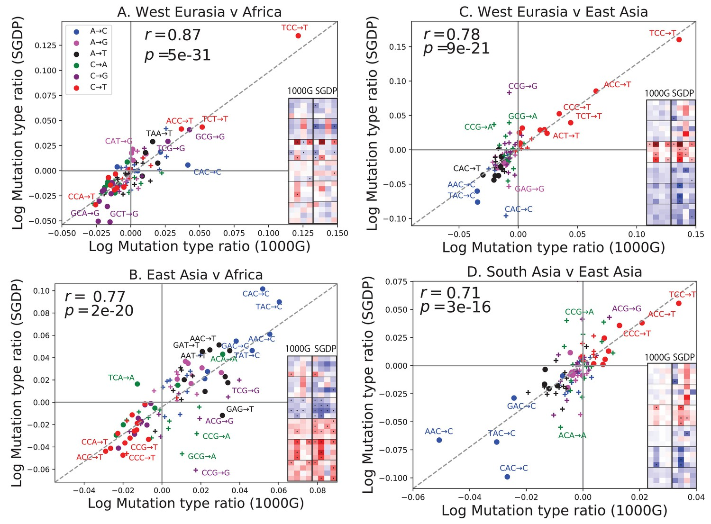
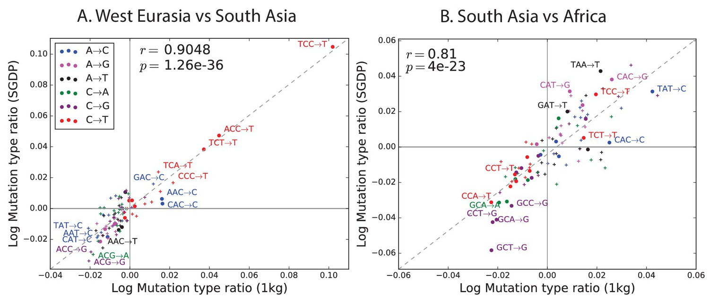

```{r setup, include=FALSE}
knitr::opts_chunk$set(echo = FALSE, message = FALSE, warning = FALSE)
knitr::opts_knit$set(root.dir = '../../data')

library(ggplot2)
library(gplots)
library(stats)
library(readr)
library(dplyr)
library(knitr)
require(reshape2)
library(gridExtra)
library(grid)
require("ggrepel")
theme_set(theme_light())
```

# Introduction

This document is meant to show all our efforts to replicate our study in the Simons Genome Diversity Project (SGDP).  Since SGDP dataset is much smaller than the 1,000 genomes dataset, extra care must be taken to conserve statistical power.  As a result, we will only replicate a subset of our discoveries from the main analysis, and restrict the number of hypothesis tests to a minimum where possible.

# Preliminary Checks for Correctness

```{r 1kg setup data}
KG_AFR_3mer_counts <- read_delim("3mer/AFR_3mer_counts.txt", 
                              "\t", escape_double = FALSE, trim_ws = TRUE)
KG_EUR_3mer_counts <- read_delim("3mer/EUR_3mer_counts.txt", 
                              "\t", escape_double = FALSE, trim_ws = TRUE)
KG_EAS_3mer_counts <- read_delim("3mer/EAS_3mer_counts.txt", 
                              "\t", escape_double = FALSE, trim_ws = TRUE)
KG_SAS_3mer_counts <- read_delim("3mer/SAS_3mer_counts.txt", 
                              "\t", escape_double = FALSE, trim_ws = TRUE)
```

```{r SGDP setup data}
AFR_3mer_counts <- read_delim("3mer/SGDP_AFR_3mer_counts.txt", 
                              "\t", escape_double = FALSE, trim_ws = TRUE)
EUR_3mer_counts <- read_delim("3mer/SGDP_EUR_3mer_counts.txt", 
                              "\t", escape_double = FALSE, trim_ws = TRUE)
EAS_3mer_counts <- read_delim("3mer/SGDP_EAS_3mer_counts.txt", 
                              "\t", escape_double = FALSE, trim_ws = TRUE)
SAS_3mer_counts <- read_delim("3mer/SGDP_SAS_3mer_counts.txt", 
                              "\t", escape_double = FALSE, trim_ws = TRUE)
```

## Visualizing dataset agreement

Below is a simple visualization of agreement between the datasets.  For a given polymorphism $c$ and population $P$, the proportion of that polymorphism in the population is defined as:

$$\frac{\text{Number of private polymorphisms of type c in population P}}{\text{Total number of private polymorphisms in population P}}$$

The plot below shows the agreement between polymorphism proportions from 1,000 genomes (x-axis) and SGDP (y-axis) for each population.

```{r}
KG_vs_SGDP_propotion_scatter <- function(KG, SGDP, title = "Proportions of mutations"){
  plt_data <- data.frame(KG_proportion = KG$Count/sum(KG$Count),
                         SGDP_proportion = SGDP$Count/sum(SGDP$Count),
                         Onemer = KG$X1mer,
                         Polymorphism = KG$Context) %>%
    mutate(labels = ifelse(abs(SGDP_proportion-KG_proportion) > 0.001, as.character(Polymorphism), ""))
  ggplot(plt_data, aes(x = KG_proportion, y = SGDP_proportion, color = Onemer)) +
    geom_point(size = 0.25) +
    theme(text = element_text(size=10))+
    geom_abline(aes(intercept=0,slope=1), size = .5, linetype = 2) +
    scale_color_manual(values=c("blue", "magenta", "black", "forestgreen","purple", "red")) +
    labs(x = "Proportion of polymorphisms (1000G)",
         y = "Proportion of polymorphisms (SGDP)", title = title) +
    geom_text_repel(aes(label = labels), size = 1.5, segment.size  = 0.2)
}
```

```{r, fig.height = 6}
a <- KG_vs_SGDP_propotion_scatter(KG_AFR_3mer_counts, AFR_3mer_counts, title = "AFR")

b <- KG_vs_SGDP_propotion_scatter(KG_EUR_3mer_counts, EUR_3mer_counts, title = "EUR")

c <- KG_vs_SGDP_propotion_scatter(KG_EAS_3mer_counts, EAS_3mer_counts, title = "EAS")

d <- KG_vs_SGDP_propotion_scatter(KG_SAS_3mer_counts, SAS_3mer_counts, title = "SAS")

grid.arrange(a,b,c,d, ncol = 2)
```

\pagebreak

## Replication of Harris and Pritchard, figure 2

Next we attempt to replicate figure 2 from Harris and Pritchard, 2017.  They first calculate the ratio of the proportion of each polymorphism in a pair of populations, then plot the agreement between the log (base $e$) of the ratios:



```{r}
#' @title: SGDP vs 1kg plot
#' @decsription: replicates plots from figure 2 of Harris and Pritchard elife 2017
#' @param: KG_POP1, KG_POP2, SGDP_POP1, SGDP_POP2.  Count dataframes from 2 pops in 1KG and SGDP
SGDP_vs_KG_plot <- function(KG_POP1, KG_POP2, SGDP_POP1, SGDP_POP2, 
                            title = "Agreement between SGDP and 1000G",
                            label = F){
  POP1_KG_proportion <- KG_POP1$Count/(sum(KG_POP1$Count))
  POP2_KG_proportion <- KG_POP2$Count/(sum(KG_POP2$Count))
  POP1_SGDP_proportion <- SGDP_POP1$Count/(sum(SGDP_POP1$Count))
  POP2_SGDP_proportion <- SGDP_POP2$Count/(sum(SGDP_POP2$Count))
  
  plt_data <- data.frame(SGDP_log_ratio = log(POP1_SGDP_proportion/POP2_SGDP_proportion),
                         KG_log_ratio = log(POP1_KG_proportion/POP2_KG_proportion),
                         Onemer = KG_POP1$X1mer,
                         Polymorphism = KG_POP1$Context) %>%
    mutate(labels = ifelse((SGDP_log_ratio+KG_log_ratio)**2 > 0.04, as.character(Polymorphism), ""))
  
  p <- ggplot(plt_data, aes(x = KG_log_ratio, y = SGDP_log_ratio, color = Onemer)) +
    geom_point(size = 0.5) +
    theme(text = element_text(size=8))+
    geom_abline(aes(intercept=0,slope=1), size = .25, linetype = 2) +
    scale_color_manual(values=c("blue", "magenta", "black", "forestgreen","purple", "red")) +
    labs(x = "Log Mutation type ratio (1000G)",
         y = "Log Mutation type ratio (SGDP)", title = title)+
    geom_hline(yintercept = 0, size = 0.25) + geom_vline(xintercept = 0, size = 0.25)
  
  if (label){
    p <- p + geom_text_repel(aes(label = labels), size = 1.5, segment.size  = 0.2)
  }
  
  return(p)
}
```

Here is our attempt at the same plot: 

```{r}
a <- SGDP_vs_KG_plot(KG_EUR_3mer_counts, KG_AFR_3mer_counts, 
                     EUR_3mer_counts, AFR_3mer_counts, title = "West Eurasia vs Africa", label = T)
b <- SGDP_vs_KG_plot(KG_EUR_3mer_counts, KG_EAS_3mer_counts, 
                     EUR_3mer_counts, EAS_3mer_counts, "West Eurasia vs East Asia", label = T)
c <- SGDP_vs_KG_plot(KG_EAS_3mer_counts, KG_AFR_3mer_counts,
                     EAS_3mer_counts, AFR_3mer_counts, "East Asia vs Africa", label = T)
d <- SGDP_vs_KG_plot(KG_SAS_3mer_counts, KG_EAS_3mer_counts, 
                     SAS_3mer_counts, EAS_3mer_counts, "South Asia vs East Asia", label = T)

grid.arrange(a,b,c,d, ncol = 2)
```

\pagebreak

Also included are two supplementary comparisons:




```{r, fig.height= 2}
a <- SGDP_vs_KG_plot(KG_EUR_3mer_counts, KG_SAS_3mer_counts, 
                     EUR_3mer_counts, SAS_3mer_counts, title = "West Eurasia vs South Asia", label = T)
b <- SGDP_vs_KG_plot(KG_SAS_3mer_counts, KG_AFR_3mer_counts, 
                     SAS_3mer_counts, AFR_3mer_counts, title = "South Asia vs Africa", label = T)

grid.arrange(a,b, ncol = 2)
```

I make the following observations:

1. The scales of the plots do not agree.  We have noted before that the trends and patterns we observe in polymorphism ratios between polymorphisms agree with Harris and Pritchard, but the exact numeric estimates do not.  It is not clear why this is.  One explanation may be that they use all polymorphism, but we use private variants only in our dataset.  Our approach may cause differences between populations to be larger than when their approach is used.

2. Whenever we make a comparison with Africa, the figures do not agree.

3. CAC -> C is consistently an outlier in comparisons with Africa.  Here are the rates in SGDP:

```{r}
gw_3mer_counts <- read_delim("gw_counts/gw_3mer_counts.txt", 
                             "\t", escape_double = FALSE, trim_ws = TRUE)
```


```{r}
#box plot of rate by chrom for a particular sequence context
chrom.box <- function(AFR, EUR, EAS, SAS, gw, mut){
  #get data
  chrom.dat <- chrom.process.data(AFR, EUR, EAS, SAS, gw, mut)
  
  n <- nchar(mut)
  ref <- substr(mut, 1, n-3)
  alt <- substr(mut, n, n)
  
  #find outliers
  AFR.rates <- subset(chrom.dat, chrom.dat$pop == "Africa")
  AFR.outliers <- subset(AFR.rates, is_outlier(AFR.rates$rate)==TRUE)
  EUR.rates <- subset(chrom.dat, chrom.dat$pop == "Europe")
  EUR.outliers <- subset(EUR.rates, is_outlier(EUR.rates$rate)==TRUE)
  EAS.rates <- subset(chrom.dat, chrom.dat$pop == "East\nAsia")
  EAS.outliers <- subset(EAS.rates, is_outlier(EAS.rates$rate)==TRUE)
  SAS.rates <- subset(chrom.dat, chrom.dat$pop == "South\nAsia")
  SAS.outliers <- subset(SAS.rates, is_outlier(SAS.rates$rate)==TRUE)
  
  #plot
  c_plot <- ggplot(chrom.dat, aes(pop, rate))+
    geom_boxplot(outlier.color = NA, fill = c("palegreen1",  "steelblue1", 'plum1', "lightcoral"))+
    labs(x = "\nPopulation", title = bquote("Mutation rate of" ~ .(ref)%->%.(alt) ~ "by chromosome"), y = NULL)+
    scale_color_manual("", values = c("forest green", "dark blue", 'magenta', "red"))+
    
    #add outlier labels
    geom_text(data = EUR.outliers, aes(pop, rate, label = chrom), color = "dark blue", nudge_x = 0.25)+
    geom_text(data = AFR.outliers, aes(pop, rate, label = chrom), color = "forest green", nudge_x = 0.25)+
    geom_text(data = EAS.outliers, aes(pop, rate, label = chrom), color = "red", nudge_x = 0.25)+
    geom_text(data = SAS.outliers, aes(pop, rate, label = chrom), color = "magenta", nudge_x = 0.25)+
    
    #add points
    geom_point(aes(color = factor(chrom.dat$pop)), size = 1.2, position = position_jitter(width = 0.1))+
    theme(axis.text.x = element_text(size = rel(.9)), axis.title.x = element_blank(), #adjust text sizes
          axis.title.y = element_text(size = rel(.9)), axis.text.y = element_text(size = rel(.9)),
          legend.position = 'none',
          title = element_text(size = rel(.7)))#legend position
  return(c_plot)
}

#helper function for ploting which formats the data for ggplot
chrom.process.data <- function(AFR, EUR, EAS, SAS, gw, mut){
  #get indicies for mutation and contextAFR, EUR, EAS, SAS, gw, mut
  i <- which(EUR$Context == mut)
  cntxt <- substr(mut, 1, nchar(mut)-3)
  i.cntxt <- which(gw$Context == cntxt)
  col.e <- ncol(AFR)
  col.s <- col.e-22
  
  #trim summary columns from each input dataframe
  AFR <- AFR[c(col.s: col.e)]
  EUR <- EUR[c(col.s: col.e)]
  EAS <- EAS[c(col.s: col.e)]
  SAS <- SAS[c(col.s: col.e)]
  gw <- gw[-c(1,2)]
  gw_totals <- colSums(gw)
  
  #make output dataframe for plot
  dat <- data.frame(matrix(nrow = 23, ncol = 4))
  colnames(dat) <- c("Africa", "Europe", "South\nAsia", "East\nAsia")  
  
  #get rates for each pop
  dat$'Europe' <- t(EUR[i,]/gw[i.cntxt,]*1.2E-8*gw_totals/colSums(EUR))
  dat$'Africa' <- t(AFR[i,]/gw[i.cntxt,]*1.2E-8*gw_totals/colSums(AFR))
  dat$'East\nAsia' <- t(EAS[i,]/gw[i.cntxt,]*1.2E-8*gw_totals/colSums(EAS))
  dat$'South\nAsia' <- t(SAS[i,]/gw[i.cntxt,]*1.2E-8*gw_totals/colSums(SAS))
  
  #melt data to necessary format
  row.names(dat) <- c('1', '2', '3', '4', '5', '6', '7', '8', '9', '10', '11', '12', '13', '14', '15', '16', '17', '18', '19', '20', '21', '22', 'X')
  dat.m <- melt(t(dat))
  colnames(dat.m) <- c("pop", "chrom", "rate")
  
  return(dat.m)
}

#helper function that returns which elements of a vector x are outliers
is_outlier <- function(x) {
  return(x < quantile(x, 0.25) - 1.5 * IQR(x) | x > quantile(x, 0.75) + 1.5 * IQR(x))
}

CI.plot <- function(AFR, EUR, EAS, SAS, mut, small = F) {
  n <- nchar(mut)
  ref <- substr(mut, 1, n-3)
  alt <- substr(mut, n, n)
  mut.i <- which(AFR$Context == mut)
  popnames <- c("AFR","EUR", "SAS", "EAS")
  colors <- c("forestgreen", "darkblue", "magenta","red")
  
  #have to do a silly workaround or R will sort popnames alphanumerically
  poplabs <- factor(popnames, levels= popnames)
  
  #cycle through pops and get counts for mut
  counts <- rep(0, 4)
  sums <- rep(0, 4)
  pops <- list(AFR, EUR, SAS, EAS)
  
  for (i in 1:length(pops)){
    counts[i] <- pops[[i]]$Count[mut.i]
    sums[i]<- sum(pops[[i]]$Count)
  }
  
  #estimate substitution probability
  N.c <- AFR$context_in_genome[mut.i] 
  theta <- counts/N.c
  L <- theta - 1.96*sqrt(theta*(1-theta)/N.c)
  U <- theta + 1.96*sqrt(theta*(1-theta)/N.c)
  
  #normalize to rate estimate; assume genome wide subsitution probability is measured without error
  norm <- 1.2E-8*(sum(as.numeric(AFR$context_in_genome))/3)/sums
  
  df <- data.frame(cbind(popnames, theta*norm, L*norm, U*norm))
  plotcol <- reorder(colors, theta*norm)
  
  CIplot <- ggplot(df, aes(reorder(popnames, c(1,2,3,4)), theta*norm)) +
    geom_point(size = 2, color = plotcol) +
    geom_errorbar(aes(ymax = U*norm, ymin = L*norm), color = plotcol, size =.75)+
    labs(title = bquote(.(ref)%->%.(alt) ~ "mutation rate"), y = NULL) + #y axis label
    theme(axis.text.x = element_text(size = rel(.7)), axis.title.x = element_blank(), #adjust text sizes
          axis.title.y = element_text(size = rel(.7)), axis.text.y = element_text(size = rel(.7), angle = 0, hjust = 0.5), title = element_text(size = rel(.5)),
          legend.position = 'none')
  
  if (small) {
    CIplot <- CIplot + theme(axis.text.x = element_blank(), axis.ticks.x = element_blank())+
      labs(title = bquote(.(ref)%->%.(alt)))
  }
  
  return(CIplot)
}
```


```{r}
d <- CI.plot(AFR_3mer_counts, EUR_3mer_counts, EAS_3mer_counts, SAS_3mer_counts, mut = "CAC->C")
e <- chrom.box(AFR_3mer_counts, EUR_3mer_counts, EAS_3mer_counts, SAS_3mer_counts,
               gw_3mer_counts,"CAC->C")

grid.arrange(d, e, ncol = 2)
```

And here they are in 1KG

```{r}
d <- CI.plot(KG_AFR_3mer_counts, KG_EUR_3mer_counts, KG_EAS_3mer_counts, KG_SAS_3mer_counts, mut = "CAC->C")
e <- chrom.box(KG_AFR_3mer_counts, KG_EUR_3mer_counts, KG_EAS_3mer_counts, KG_SAS_3mer_counts,
               gw_3mer_counts,"CAC->C")

grid.arrange(d, e, ncol = 2)
```

Looking through Harris and Pritchard's figures, their relative rates for CAC->C are:


EAS $\sim$ EUR > SAS > AFR.  


# 3-mer Substitution Classes that Vary Across Continents

## Test for Homogenity Across all Continental Groups

Here, we run the same p-ordered hypothesis test the we used on the 1,000 genomes dataset.  However, we will test for the significance of variation in the top 15 polymorphism classes listed in Table 1.

To make this table, we need the following **functions** and *datasets*:

* *3mer count dataframes for all ancestral continental groups*

* **Fourway.chi** Tests for heterogeneity among any four count dataframes
* **ordered.p** performs ordered p value correction

```{r T1 setup methods}
# calculates homogeneity test p values for Fourway comparisons of counts dfs
fourway.chi <- function(AFR, EUR, EAS, SAS, filter = T){
  n.contexts = length(AFR$Context)
  
  # make dataframe for results
  result <- data.frame(matrix(ncol=9,nrow=n.contexts))
  colnames(result) <- c("Context", "X5mer","X3mer", "X1mer", 
                        "AFR.Count", "EUR.Count", "EAS.Count", "SAS.Count", "p")
  result$Context <- AFR$Context
  result$X5mer <- AFR$X5mer # for smaller contexts, X3mer and X5mer columns do not exist,
  result$X3mer <- AFR$X3mer # and will disappear at this step
  result$X1mer <- AFR$X1mer 
  result$AFR.Count <- AFR$Count; result$EUR.Count <- EUR$Count
  result$EAS.Count <- EAS$Count; result$SAS.Count <- SAS$Count
  
  # start setting up tables
  sums <- c(sum(AFR$Count), sum(EUR$Count), sum(EAS$Count), sum(SAS$Count))
  
  # set up table and run test for each context
  for (i in 1:n.contexts){
    c.a <- c(AFR$Count[i], EUR$Count[i], EAS$Count[i], SAS$Count[i])
    c.b <- sums - c.a
    data <- cbind(c.a, c.b)
    warning <- is(tryCatch(chisq.test(data), warning = function(w) w), "warning")
    if (filter == T & warning){
      result$p[i] <- NA}
    else result$p[i] <- chisq.test(data)$p.value
    }
  return(result)
}

ordered.p <- function(pdata){
  # preprocess data to order and remove nas 
  pdata <- pdata[complete.cases(pdata$p),]
  myorder <- order(pdata$p)
  n.muts <- length(pdata$p)
  
  p.ordered <- rep(0, n.muts)
  
  # set largest p-value 
  j <- myorder[n.muts]
  p.ordered[j] <- pdata$p[j]
  
  # initialize not mutated counts based on this lowest p-value mutation
  not.mut <- c(pdata$AFR.Count[j], pdata$EUR.Count[j], 
               pdata$EAS.Count[j], pdata$SAS.Count[j])
  
  for (i in n.muts:1){
    j <- myorder[i]
    mut <-c(pdata$AFR.Count[j], pdata$EUR.Count[j], 
            pdata$EAS.Count[j], pdata$SAS.Count[j])
    data <- cbind(mut, not.mut)
    p.ordered[j] <- chisq.test(data)$p.value
    
    # add these mutations to the not.mutated counts for future tests
    not.mut <- not.mut + mut
  }
  pdata$p <- p.ordered
  return(pdata)
}

pairwise.op <- function(pdata){
  # preprocess data to order and remove nas 
  pdata <- pdata[complete.cases(pdata$p),]
  myorder <- order(pdata$p)
  n.muts <- length(pdata$p)
  
  p.ordered <- rep(0, n.muts)
  
  # set largest p-value 
  j <- myorder[n.muts]
  p.ordered[j] <- pdata$p[j]
  
  # initialize not mutated counts based on this lowest p-value mutation
  not.mut <- c(pdata$Counts1[j], pdata$Counts2[j])
  
  for (i in n.muts:1){
    j <- myorder[i]
    mut <-c(pdata$Counts1[j], pdata$Counts2[j])
    data <- cbind(mut, not.mut)
    p.ordered[j] <- chisq.test(data)$p.value
    
    # add these mutations to the not.mutated counts for future tests
    not.mut <- not.mut + mut
  }
  pdata$p <- p.ordered
  return(pdata)
}
```

```{r run tests}
top_15_from_1kg <- c("TCC->T", "ACC->T", "TCT->T",
                     "GAT->T", "ACC->A", "CCC->T",
                     "ACA->T", "TCA->T", "ACT->T",
                     "TCG->T", "ACG->T", "GCG->T",
                     "GCT->T", "GAC->T", "GCC->T")

# calculate ordered p values
p.3mer <- fourway.chi(AFR_3mer_counts, EUR_3mer_counts, EAS_3mer_counts, SAS_3mer_counts)
o.p.3mer <- ordered.p(p.3mer)

# Construct table 1
rates <- cbind(AFR_3mer_counts$Rate, EUR_3mer_counts$Rate, SAS_3mer_counts$Rate, EAS_3mer_counts$Rate)
table1 <- data.frame(cbind(o.p.3mer$Context, rates/AFR_3mer_counts$Rate, o.p.3mer$p))
colnames(table1)<- c("Context", "AFR_relative_rate", "EUR_relative_rate", "SAS_relative_rate", "EAS_relative_rate", "p")

table1_SGDP <- filter(table1, Context %in% top_15_from_1kg) %>%
  mutate("EUR_relative_rate" = round(as.numeric(as.character(EUR_relative_rate)), digits = 2),
         EAS_relative_rate = round(as.numeric(as.character(EAS_relative_rate)), digits = 2),
         SAS_relative_rate = round(as.numeric(as.character(SAS_relative_rate)), digits = 2)) %>%
  arrange(as.numeric(as.character(p)))

# show result
kable(table1_SGDP, digits = 600, row.names = F,
      caption = "Replication of Table 1 with data from SGDP")
```

## Inferred Mutation Rate in top 15 Heterogeneous 3-mers

Here, we will calculate the inferred mutation rate of the 3-mers from table 1.

```{r load gw_3mer_counts }
gw_3mer_counts <- read_delim("gw_counts/gw_3mer_counts.txt", 
                             "\t", escape_double = FALSE, trim_ws = TRUE)
```

```{r S2 functions}
CI.plot <- function(AFR, EUR, EAS, SAS, mut, small = F) {
  n <- nchar(mut)
  ref <- substr(mut, 1, n-3)
  alt <- substr(mut, n, n)
  mut.i <- which(AFR$Context == mut)
  popnames <- c("AFR","EUR", "SAS", "EAS")
  colors <- c("forestgreen", "darkblue", "magenta","red")
  
  #have to do a silly workaround or R will sort popnames alphanumerically
  poplabs <- factor(popnames, levels= popnames)
  
  #cycle through pops and get counts for mut
  counts <- rep(0, 4)
  sums <- rep(0, 4)
  pops <- list(AFR, EUR, SAS, EAS)
  
  for (i in 1:length(pops)){
    counts[i] <- pops[[i]]$Count[mut.i]
    sums[i]<- sum(pops[[i]]$Count)
  }
  
  #estimate substitution probability
  N.c <- AFR$context_in_genome[mut.i] 
  theta <- counts/N.c
  L <- theta - 1.96*sqrt(theta*(1-theta)/N.c)
  U <- theta + 1.96*sqrt(theta*(1-theta)/N.c)
  
  #normalize to rate estimate; assume genome wide subsitution probability is measured without error
  norm <- 1.2E-8*(sum(as.numeric(AFR$context_in_genome))/3)/sums
  
  df <- data.frame(cbind(popnames, theta*norm, L*norm, U*norm))
  plotcol <- reorder(colors, theta*norm)
  
  CIplot <- ggplot(df, aes(reorder(popnames, c(1,2,3,4)), theta*norm)) +
    geom_point(size = 2, color = plotcol) +
    geom_errorbar(aes(ymax = U*norm, ymin = L*norm), color = plotcol, size =.75)+
    labs(title = bquote(.(ref)%->%.(alt) ~ "mutation rate"), y = NULL) + #y axis label
    theme(axis.text.x = element_text(size = rel(.7)), axis.title.x = element_blank(), #adjust text sizes
          axis.title.y = element_text(size = rel(.7)), axis.text.y = element_text(size = rel(.7), angle = 0, hjust = 0.5), title = element_text(size = rel(.5)),
          legend.position = 'none')
  
  if (small) {
    CIplot <- CIplot + theme(axis.text.x = element_blank(), axis.ticks.x = element_blank())+
      labs(title = bquote(.(ref)%->%.(alt)))
  }
  
  return(CIplot)
}
```

```{r, fig.keep = "none" }
blank <- grid.rect(gp=gpar(col="white"))
```

```{r S2 make figure, fig.height = 8, fig.width=7}
a <- CI.plot(AFR_3mer_counts, EUR_3mer_counts, EAS_3mer_counts, SAS_3mer_counts, "TCC->T", small = F)
b <- CI.plot(AFR_3mer_counts, EUR_3mer_counts, EAS_3mer_counts, SAS_3mer_counts, "ACC->T", small = F)
c <- CI.plot(AFR_3mer_counts, EUR_3mer_counts, EAS_3mer_counts, SAS_3mer_counts, "TCT->T", small = F)
d <- CI.plot(AFR_3mer_counts, EUR_3mer_counts, EAS_3mer_counts, SAS_3mer_counts, "CCC->T", small = F)
e <- CI.plot(AFR_3mer_counts, EUR_3mer_counts, EAS_3mer_counts, SAS_3mer_counts, "TCA->T", small = F)
f <- CI.plot(AFR_3mer_counts, EUR_3mer_counts, EAS_3mer_counts, SAS_3mer_counts, "ACT->T", small = F)
g <- CI.plot(AFR_3mer_counts, EUR_3mer_counts, EAS_3mer_counts, SAS_3mer_counts, "GCC->T", small = F)
h <- CI.plot(AFR_3mer_counts, EUR_3mer_counts, EAS_3mer_counts, SAS_3mer_counts, "GAT->T", small = F)
i <- CI.plot(AFR_3mer_counts, EUR_3mer_counts, EAS_3mer_counts, SAS_3mer_counts, "ACC->A", small = F)
j <- CI.plot(AFR_3mer_counts, EUR_3mer_counts, EAS_3mer_counts, SAS_3mer_counts, "GCT->T", small = F)
k <- CI.plot(AFR_3mer_counts, EUR_3mer_counts, EAS_3mer_counts, SAS_3mer_counts, "GAC->T", small = F)
l <- CI.plot(AFR_3mer_counts, EUR_3mer_counts, EAS_3mer_counts, SAS_3mer_counts, "TCG->T", small = F)
m <- CI.plot(AFR_3mer_counts, EUR_3mer_counts, EAS_3mer_counts, SAS_3mer_counts, "ACG->T", small = F)
n <- CI.plot(AFR_3mer_counts, EUR_3mer_counts, EAS_3mer_counts, SAS_3mer_counts, "GCG->T", small = F)
o <- CI.plot(AFR_3mer_counts, EUR_3mer_counts, EAS_3mer_counts, SAS_3mer_counts, "ACA->T", small = F)

grid.arrange(a,b,c,d,e,f,g,blank, h,i,j,k,l,m,n,o, ncol = 4)
```

## Signatures of Variation at the 3-mer Level

We will not attempt to construct a heatmap of the 3-mer signatures from the SGDP data, since this analysis on 1,000 genomes was mostly heuristic.  However, we will plot the inferred mutation rate from SGDP for each of the signatures reported in figure 1.

To make these panels, I need the following **functions** and *datasets*:

* **CI.plot.bygroup** Makes a plot of the rates of a group of mutations.  Will bug out if the mutations are of the same context, although that's not a problem for these figures.

```{r F1BCD setup methods}
CI.plot.bygroup <- function(AFR, EUR, EAS, SAS, muts, groupname = "mutation group") {
  #NOTE: muts must all be from different contexts.  Otherwise this will do weird things.
  
  muts.i <- which(is.element(AFR$Context, muts))
  popnames <- c("Africa","Europe", "South\nAsia\n\n", "East\nAsia\n\n")
  colors <- c("forestgreen", "darkblue", "magenta","red")
  
  #have to do a silly workaround or R will sort popnames alphanumerically
  poplabs <- factor(popnames, levels= popnames)
  
  #cycle through pops and get counts for mut
  counts <- rep(0, 4)
  sums <- rep(0, 4)
  pops <- list(AFR, EUR, SAS, EAS)
  
  for (i in 1:length(pops)){
    counts[i] <- sum(pops[[i]]$Count[muts.i]) #number of obersvations of muts in pop
    sums[i]<- sum(pops[[i]]$Count)#total polymorphisms in pop
  }
  
  #estimate substitution probability
  N.c <- sum(AFR$context_in_genome[muts.i])
  theta <- counts/N.c
  L <- theta - 1.96*sqrt(theta*(1-theta)/N.c)
  U <- theta + 1.96*sqrt(theta*(1-theta)/N.c)
  
  #normalize to rate estimate; assume genome wide subsitution probability is measured without error
  norm <- 1.2E-8*(sum(as.numeric(AFR$context_in_genome))/3)/sums
  
  df <- data.frame(cbind(popnames, theta*norm, L*norm, U*norm))
  plotcol <- reorder(colors, theta*norm)
  
  CI.plot <- ggplot(df, aes(reorder(popnames, c(1,2,3,4)), theta*norm)) +
    geom_point(size = 3, color = plotcol) +
    geom_errorbar(aes(ymax = U*norm, ymin = L*norm), color = plotcol, size =.75)+
    labs(title = paste("Estimated mutation\nrate of", groupname), y = NULL) + #y axis label
    theme(axis.text.x = element_text(size = rel(.8)), axis.title.x = element_blank(), #adjust text sizes
          axis.title.y = element_text(size = rel(.9)), axis.text.y = element_text(size = rel(.9), angle = 0, hjust = 0.5), title = element_text(size = rel(.7)),
          legend.position = 'none')
  return(CI.plot)
}

```

```{r F1BCD make, fig.height=2.5, fig.width=6.5}
s1 <- c("TCT->T", "ACC->T", "TCA->T", "CCC->T", "ACT->T", "TCC->T", "GCC->T")
a <- CI.plot.bygroup(AFR_3mer_counts, EUR_3mer_counts, EAS_3mer_counts, SAS_3mer_counts, s1, "profile #1")

s2 <- c("GAT->T", "ACC->A", "GAC->T")
b <- CI.plot.bygroup(AFR_3mer_counts, EUR_3mer_counts, EAS_3mer_counts, SAS_3mer_counts, s2, "profile #2")

s4 <-c("ACG->T", "CCG->T", "GCG->T", "TCG->T")
d <- CI.plot.bygroup(AFR_3mer_counts, EUR_3mer_counts, EAS_3mer_counts, SAS_3mer_counts, s4, "profile #4")

grid.arrange(a, b, d, ncol = 3)
```


# Broader Sequence Contexts of 3-mer Signatures

We will not attempt to replicate scatter plots as in Figure 2 because it is not likely that inferred mutation rate for 7-mers in SGDP will be accurate enough for these plots to be meaningful.  Likewise, the suggestion that certain 7-mers are driving the *AC$\rightarrow$C enrichment in Japan compared to East Asia is an interesting result, but since there are 5 Chinese Dai and 3 Japanese individuals in SGDP, attempting to replicate this result may not be appropriate.  Ideally, this preliminary finding could be replicated and perhaps further explored in a large Asian genomic dataset, the likes of which, to our knowledge, are currently not publically available.

# Signatures of Variation at Broader Sequence Contexts

We will not attempt hypothesis testing across all 5-mer and 7-mer polymorphism classes, since many of these tests are sure to invlolve too few observations to be carried out, and the hypothesis testing burden would massively reduce statistical power.  Rather, we will repeat the hypothesis tests for only the 7-mer classes shown in table 3.

```{r load 7mer data}
AFR_7mer_counts <- read.delim('7mer/AFR_7mer_counts.txt')
EUR_7mer_counts <- read.delim('7mer/EUR_7mer_counts.txt')
EAS_7mer_counts <- read.delim('7mer/EAS_7mer_counts.txt')
SAS_7mer_counts <- read.delim('7mer/SAS_7mer_counts.txt')

gw_7mer_counts <- read_delim("gw_counts/gw_7mer_counts.txt", 
                             "\t", escape_double = FALSE, trim_ws = TRUE)
```

```{r}
table_3_7mers <- c("CAAACCC->C", "TTTATTT->T", "TTTAAAA->T", "ATTAAAA->T", "AAACAAA->A")

# calculate ordered p values
p.7mer <- fourway.chi(AFR_7mer_counts, EUR_7mer_counts, EAS_7mer_counts, SAS_7mer_counts)
o.p.7mer <- ordered.p(p.7mer)

# extract significantly variable mutation types and order by p value
rates <- cbind(AFR_7mer_counts$Rate, EUR_7mer_counts$Rate, SAS_7mer_counts$Rate, EAS_7mer_counts$Rate)
table3 <- cbind(o.p.7mer$Context, rates/AFR_7mer_counts$Rate, o.p.7mer$p)
colnames(table3)<- c("Context", "AFR relative rate", "EUR relative rate", "SAS relative rate", "EAS relative rate", "p")

table3_SGDP <- filter(table1, Context %in% table_3_7mers) %>%
  arrange(-p)

kable(table3_SGDP, digits = 600, row.names = F,
      caption = "Table 3 recalculated with SGDP data")
```

We will additionally plot the inferred mutation rate of the WTTAAA$\rightarrow$T 7-mers across continents. We can't use my usual graphing function to make This figure because there are '$\rightarrow$' characters that we need to insert in the plot text.  

```{r F4B set up data}
muts <- c("TTTAAAA->T", "ATTAAAA->T")
AFR <- AFR_7mer_counts
EUR <- EUR_7mer_counts
EAS <- EAS_7mer_counts
SAS <- SAS_7mer_counts
```

```{r}
#NOTE: muts must all be from different contexts.  Otherwise this will do weird things.
muts.i <- which(is.element(AFR$Context, muts))
popnames <- c("Africa","Europe", "South\nAsia", "East\nAsia")
colors <- c("forestgreen", "darkblue", "magenta","red")

#have to do a silly workaround or R will sort popnames alphanumerically
poplabs <- factor(popnames, levels= popnames)

#cycle through pops and get counts for mut
counts <- rep(0, 4)
sums <- rep(0, 4)
pops <- list(AFR, EUR, SAS, EAS)

for (i in 1:length(pops)){
  counts[i] <- sum(pops[[i]]$Count[muts.i]) #number of obersvations of muts in pop
  sums[i]<- sum(pops[[i]]$Count)#total polymorphisms in pop
}

#estimate substitution probability
N.c <- sum(AFR$context_in_genome[muts.i])
theta <- counts/N.c
L <- theta - 1.96*sqrt(theta*(1-theta)/N.c)
U <- theta + 1.96*sqrt(theta*(1-theta)/N.c)

#normalize to rate estimate; assume genome wide subsitution probability is measured without error
norm <- 1.2E-8*(sum(as.numeric(AFR$context_in_genome))/3)/sums

df <- data.frame(cbind(popnames, theta*norm, L*norm, U*norm))
plotcol <- reorder(colors, theta*norm)

b <- ggplot(df, aes(reorder(popnames, c(1,2,3,4)), theta*norm)) +
  geom_point(size = 3, color = plotcol) +
  geom_errorbar(aes(ymax = U*norm, ymin = L*norm), color = plotcol, size =.75)+
  labs(y =  bquote(paste("Mutation rate of")~.("TTTAAAA")%->%.("T")~paste("and")~.("ATTAAAA")%->%.("T"))) + #y axis label
  theme(axis.text.x = element_text(size = rel(.9)), axis.title.x = element_blank(), #adjust text sizes
        axis.title.y = element_text(size = rel(1)), axis.text.y = element_text(size = rel(1), angle = 0, hjust = 0.5), title = element_text(size = rel(.7)),
        legend.position = 'none')

print(b)
```

