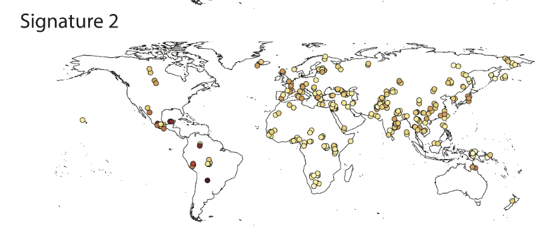

```{r setup, include=FALSE}
knitr::opts_chunk$set(echo = FALSE, message = FALSE, warning = FALSE, fig.align = "center")
knitr::opts_knit$set(root.dir = '../../data')

library(ggplot2)
library(gplots)
library(stats)
library(readr)
library(dplyr)
library(knitr)
require(reshape2)
library(gridExtra)
library(grid)
require("ggrepel")
theme_set(theme_light())
```


```{r 1kg setup data}
KG_AFR_3mer_counts <- read_delim("3mer/AFR_3mer_counts.txt", 
                              "\t", escape_double = FALSE, trim_ws = TRUE)
KG_EUR_3mer_counts <- read_delim("3mer/EUR_3mer_counts.txt", 
                              "\t", escape_double = FALSE, trim_ws = TRUE)
KG_EAS_3mer_counts <- read_delim("3mer/EAS_3mer_counts.txt", 
                              "\t", escape_double = FALSE, trim_ws = TRUE)
KG_SAS_3mer_counts <- read_delim("3mer/SAS_3mer_counts.txt", 
                              "\t", escape_double = FALSE, trim_ws = TRUE)
```

```{r SGDP setup data}
AFR_3mer_counts <- read_delim("3mer/SGDP_AFR_3mer_counts.txt", 
                              "\t", escape_double = FALSE, trim_ws = TRUE)
EUR_3mer_counts <- read_delim("3mer/SGDP_EUR_3mer_counts.txt", 
                              "\t", escape_double = FALSE, trim_ws = TRUE)
EAS_3mer_counts <- read_delim("3mer/SGDP_EAS_3mer_counts.txt", 
                              "\t", escape_double = FALSE, trim_ws = TRUE)
SAS_3mer_counts <- read_delim("3mer/SGDP_SAS_3mer_counts.txt", 
                              "\t", escape_double = FALSE, trim_ws = TRUE)
```


# Introduction

This document is meant to show all our efforts to replicate our study in the Simons Genome Diversity Project (SGDP).  Since SGDP dataset is much smaller than the 1,000 genomes dataset, extra care must be taken to conserve statistical power.  As a result, we will only replicate a subset of our discoveries from the main analysis, and restrict the number of hypothesis tests to a minimum where possible.

```{r}
kable(data.frame(Study = c("1,000 Genomes", "SGDP"), 
           Africans = c(504, 44), 
           Europeans = c(503, 69),
           "East Asians" = c(504,47),
           "South Asians" = c(489, 39)), caption = "Sample sizes from 1,000 Genomes and SGDP")


kable(data.frame(Study = c("1,000 Genomes", "SGDP"), 
           Africans = c(sum(KG_AFR_3mer_counts$Count)/10^6, sum(AFR_3mer_counts$Count)/10^6), 
           Europeans = c(sum(KG_EUR_3mer_counts$Count)/10^6, sum(EUR_3mer_counts$Count)/10^6),
           "East Asians" = c(sum(KG_EAS_3mer_counts$Count)/10^6,sum(EAS_3mer_counts$Count)/10^6),
           "South Asians" = c(sum(KG_SAS_3mer_counts$Count)/10^6, sum(SAS_3mer_counts$Count)/10^6)),
      caption = "Variant counts from 1,000 Genomes and SGDP (millions)", digits=1)
```


\pagebreak

# 0. Basic Checks of SGDP Data

Here are some basic visualizations of the SGDP Data and their match up with 1KG and previous results.

## 0.1 Visualizing dataset agreement

Below is a simple visualization of agreement between the datasets.  For a given polymorphism $c$ and population $P$, the proportion of that polymorphism in the population is defined as:

$$\frac{\text{Number of private polymorphisms of type c in population P}}{\text{Total number of private polymorphisms in population P}}$$

The plot below shows the agreement between polymorphism proportions from 1,000 genomes (x-axis) and SGDP (y-axis) for each population.

```{r}
KG_vs_SGDP_propotion_scatter <- function(KG, SGDP, title = "Proportions of mutations"){
  plt_data <- data.frame(KG_proportion = KG$Count/sum(KG$Count),
                         SGDP_proportion = SGDP$Count/sum(SGDP$Count),
                         Onemer = KG$X1mer,
                         Polymorphism = KG$Context) %>%
    mutate(labels = ifelse(abs(SGDP_proportion-KG_proportion) > 0.001, as.character(Polymorphism), ""))
  ggplot(plt_data, aes(x = KG_proportion, y = SGDP_proportion, color = Onemer)) +
    geom_point(size = 0.25) +
    theme(text = element_text(size=10), legend.position = "None")+
    geom_abline(aes(intercept=0,slope=1), size = .5, linetype = 2) +
    scale_color_manual(values=c("blue", "magenta", "black", "forestgreen","purple", "red")) +
    labs(x = "Proportion of polymorphisms (1000G)",
         y = "Proportion of polymorphisms (SGDP)", title = title) +
    geom_text_repel(aes(label = labels), size = 1.5, segment.size  = 0.2)
}
```

```{r, fig.height = 6}
a <- KG_vs_SGDP_propotion_scatter(KG_AFR_3mer_counts, AFR_3mer_counts, title = "AFR")

b <- KG_vs_SGDP_propotion_scatter(KG_EUR_3mer_counts, EUR_3mer_counts, title = "EUR")

c <- KG_vs_SGDP_propotion_scatter(KG_EAS_3mer_counts, EAS_3mer_counts, title = "EAS")

d <- KG_vs_SGDP_propotion_scatter(KG_SAS_3mer_counts, SAS_3mer_counts, title = "SAS")

grid.arrange(a,b,c,d, ncol = 2)
```

\pagebreak

Qualitatively, there is relatively good agreement between the datasets.  A few differences are noticeable:

1) There is a higher proportion of TCT$\rightarrow$T substitutions in SGDP than 1KG in all populations, especially Europeans.

2) The following A$\rightarrow$T substitutions are more abundant in SGDP in all populations: AAA$\rightarrow$T, TAA$\rightarrow$T, TAT$\rightarrow$T, and (somewhat), AAT$\rightarrow$T.

3) The following A$\rightarrow$C substitutions are more abundant in SGDP in Europe, East Asia, and South Asia: CAA$\rightarrow$C, AAA$\rightarrow$C, CAC$\rightarrow$C, and (somewhat) AAC$\rightarrow$C.  AAA$\rightarrow$C also may be slightly more abundant in Africa in SGDP than in 1KG.

However, when we plot the agreement in mutation rate, it is immediately evident that the inferred private mutation rates of CpGs are much lower in SGDP than in 1KG in all populations except Africa

```{r}
KG_vs_SGDP_rate_scatter <- function(KG, SGDP, title = "Proportions of mutations"){
  plt_data <- data.frame(KG_rate = KG$Rate,
                         SGDP_rate = SGDP$Rate,
                         Onemer = KG$X1mer,
                         Polymorphism = KG$Context) %>%
    mutate(labels = ifelse(abs(SGDP_rate-KG_rate) > 01e-9, as.character(Polymorphism), ""))
  ggplot(plt_data, aes(x = KG_rate, y = SGDP_rate, color = Onemer)) +
    geom_point(size = 0.25) +
    theme(text = element_text(size=10), legend.position = "None")+
    geom_abline(aes(intercept=0,slope=1), size = .5, linetype = 2) +
    scale_color_manual(values=c("blue", "magenta", "black", "forestgreen","purple", "red")) +
    labs(x = "Private mutation rate (1000G)",
         y = "Private mutation rate (SGDP)", title = title) +
    geom_text_repel(aes(label = labels), size = 1.5, segment.size  = 0.2)
}
```

```{r, fig.height = 6}
a <- KG_vs_SGDP_rate_scatter(KG_AFR_3mer_counts, AFR_3mer_counts, title = "AFR")

b <- KG_vs_SGDP_rate_scatter(KG_EUR_3mer_counts, EUR_3mer_counts, title = "EUR")

c <- KG_vs_SGDP_rate_scatter(KG_EAS_3mer_counts, EAS_3mer_counts, title = "EAS")

d <- KG_vs_SGDP_rate_scatter(KG_SAS_3mer_counts, SAS_3mer_counts, title = "SAS")

grid.arrange(a,b,c,d, ncol = 2)
```

\pagebreak

## 0.2 Agreement with Harris and Pritchard

Next we attempt to replicate figure 2 from Harris and Pritchard, 2017 (above).  They first calculate the ratio of the proportion of each polymorphism in a pair of populations, then plot the agreement between the log (base $e$) of the ratios:

```{r}
include_graphics("KHJP_Fig2.jpg")
```

**Note: Harris and Pritchard project the site frequency spectrum of the 1,000 genomes dataset onto the sample size of SGDP.**  It is not clear to me how this would change the results.  We do not take this extra step.

\pagebreak

```{r}
#' @title: SGDP vs 1kg plot
#' @decsription: replicates plots from figure 2 of Harris and Pritchard elife 2017
#' @param: KG_POP1, KG_POP2, SGDP_POP1, SGDP_POP2.  Count dataframes from 2 pops in 1KG and SGDP
SGDP_vs_KG_plot <- function(KG_POP1, KG_POP2, SGDP_POP1, SGDP_POP2, 
                            title = "Agreement between SGDP and 1000G",
                            label = F){
  POP1_KG_proportion <- KG_POP1$Count/(sum(KG_POP1$Count))
  POP2_KG_proportion <- KG_POP2$Count/(sum(KG_POP2$Count))
  POP1_SGDP_proportion <- SGDP_POP1$Count/(sum(SGDP_POP1$Count))
  POP2_SGDP_proportion <- SGDP_POP2$Count/(sum(SGDP_POP2$Count))
  
  plt_data <- data.frame(SGDP_log_ratio = log(POP1_SGDP_proportion/POP2_SGDP_proportion),
                         KG_log_ratio = log(POP1_KG_proportion/POP2_KG_proportion),
                         Onemer = KG_POP1$X1mer,
                         Polymorphism = KG_POP1$Context) %>%
    mutate(labels = ifelse((SGDP_log_ratio+KG_log_ratio)**2 > 0.04, as.character(Polymorphism), ""))
  
  p <- ggplot(plt_data, aes(x = KG_log_ratio, y = SGDP_log_ratio, color = Onemer)) +
    geom_point(size = 0.5) +
    theme(text = element_text(size=8), legend.position = "None")+
    geom_abline(aes(intercept=0,slope=1), size = .25, linetype = 2) +
    scale_color_manual(values=c("blue", "magenta", "black", "forestgreen","purple", "red")) +
    labs(x = "Log Mutation type ratio (1000G)",
         y = "Log Mutation type ratio (SGDP)", title = title)+
    geom_hline(yintercept = 0, size = 0.25) + geom_vline(xintercept = 0, size = 0.25)
  
  if (label){
    p <- p + geom_text_repel(aes(label = labels), size = 1.5, segment.size  = 0.2)
  }
  
  return(p)
}
```

Here is our attempt at the same plot: 

```{r, fig.height = 5.5}
a <- SGDP_vs_KG_plot(KG_EUR_3mer_counts, KG_AFR_3mer_counts, 
                     EUR_3mer_counts, AFR_3mer_counts, title = "West Eurasia vs Africa", label = T)
b <- SGDP_vs_KG_plot(KG_EUR_3mer_counts, KG_EAS_3mer_counts, 
                     EUR_3mer_counts, EAS_3mer_counts, "West Eurasia vs East Asia", label = T)
c <- SGDP_vs_KG_plot(KG_EAS_3mer_counts, KG_AFR_3mer_counts,
                     EAS_3mer_counts, AFR_3mer_counts, "East Asia vs Africa", label = T)
d <- SGDP_vs_KG_plot(KG_SAS_3mer_counts, KG_EAS_3mer_counts, 
                     SAS_3mer_counts, EAS_3mer_counts, "South Asia vs East Asia", label = T)

grid.arrange(a,b,c,d, ncol = 2)
```

\pagebreak

Also included are two supplementary comparisons:

```{r}
include_graphics("KHJP_Fig2S2.jpg")
```

```{r, fig.height= 3}
a <- SGDP_vs_KG_plot(KG_EUR_3mer_counts, KG_SAS_3mer_counts, 
                     EUR_3mer_counts, SAS_3mer_counts, title = "West Eurasia vs South Asia", label = T)
b <- SGDP_vs_KG_plot(KG_SAS_3mer_counts, KG_AFR_3mer_counts, 
                     SAS_3mer_counts, AFR_3mer_counts, title = "South Asia vs Africa", label = T)

grid.arrange(a,b, ncol = 2)
```

I make the following observations:

1. The scales of the plots do not agree.  We have noted before that the trends and patterns we observe in polymorphism ratios between polymorphisms agree with Harris and Pritchard, but the exact numeric estimates do not.  It is not clear why this is.  One explanation may be that they use all polymorphism, but we use private variants only in our dataset.  However, redoing the analysis with shared variants included does not fix the discrepancy.  It is possible (though unlikely) that Harris and Pritchard were using logarithm base 10 rather than the natural log to make these figures, which would explain a discrepancy by a factor of three. However, they state in their manuscript that the natural logarithm was used.

2. Whenever we make a comparison with Africa, the figures do not agree.

3. CAC -> C is consistently an outlier in comparisons with Africa.  Here are the rates in SGDP:

```{r}
gw_3mer_counts <- read_delim("gw_counts/gw_3mer_counts.txt", 
                             "\t", escape_double = FALSE, trim_ws = TRUE)
```

```{r}
#box plot of rate by chrom for a particular sequence context
chrom.box <- function(AFR, EUR, EAS, SAS, gw, mut){
  #get data
  chrom.dat <- chrom.process.data(AFR, EUR, EAS, SAS, gw, mut)
  
  n <- nchar(mut)
  ref <- substr(mut, 1, n-3)
  alt <- substr(mut, n, n)
  
  #find outliers
  AFR.rates <- subset(chrom.dat, chrom.dat$pop == "Africa")
  AFR.outliers <- subset(AFR.rates, is_outlier(AFR.rates$rate)==TRUE)
  EUR.rates <- subset(chrom.dat, chrom.dat$pop == "Europe")
  EUR.outliers <- subset(EUR.rates, is_outlier(EUR.rates$rate)==TRUE)
  EAS.rates <- subset(chrom.dat, chrom.dat$pop == "East\nAsia")
  EAS.outliers <- subset(EAS.rates, is_outlier(EAS.rates$rate)==TRUE)
  SAS.rates <- subset(chrom.dat, chrom.dat$pop == "South\nAsia")
  SAS.outliers <- subset(SAS.rates, is_outlier(SAS.rates$rate)==TRUE)
  
  #plot
  c_plot <- ggplot(chrom.dat, aes(pop, rate))+
    geom_boxplot(outlier.color = NA, fill = c("palegreen1",  "steelblue1", 'plum1', "lightcoral"))+
    labs(x = "\nPopulation", title = bquote("Mutation rate of" ~ .(ref)%->%.(alt) ~ "by chromosome"), y = NULL)+
    scale_color_manual("", values = c("forest green", "dark blue", 'magenta', "red"))+
    
    #add outlier labels
    geom_text(data = EUR.outliers, aes(pop, rate, label = chrom), color = "dark blue", nudge_x = 0.25)+
    geom_text(data = AFR.outliers, aes(pop, rate, label = chrom), color = "forest green", nudge_x = 0.25)+
    geom_text(data = EAS.outliers, aes(pop, rate, label = chrom), color = "red", nudge_x = 0.25)+
    geom_text(data = SAS.outliers, aes(pop, rate, label = chrom), color = "magenta", nudge_x = 0.25)+
    
    #add points
    geom_point(aes(color = factor(chrom.dat$pop)), size = 1.2, position = position_jitter(width = 0.1))+
    theme(axis.text.x = element_text(size = rel(.9)), axis.title.x = element_blank(), #adjust text sizes
          axis.title.y = element_text(size = rel(.9)), axis.text.y = element_text(size = rel(.9)),
          legend.position = 'none',
          title = element_text(size = rel(.7)))#legend position
  return(c_plot)
}

#helper function for ploting which formats the data for ggplot
chrom.process.data <- function(AFR, EUR, EAS, SAS, gw, mut){
  #get indicies for mutation and contextAFR, EUR, EAS, SAS, gw, mut
  i <- which(EUR$Context == mut)
  cntxt <- substr(mut, 1, nchar(mut)-3)
  i.cntxt <- which(gw$Context == cntxt)
  col.e <- ncol(AFR)
  col.s <- col.e-22
  
  #trim summary columns from each input dataframe
  AFR <- AFR[c(col.s: col.e)]
  EUR <- EUR[c(col.s: col.e)]
  EAS <- EAS[c(col.s: col.e)]
  SAS <- SAS[c(col.s: col.e)]
  gw <- gw[-c(1,2)]
  gw_totals <- colSums(gw)
  
  #make output dataframe for plot
  dat <- data.frame(matrix(nrow = 23, ncol = 4))
  colnames(dat) <- c("Africa", "Europe", "South\nAsia", "East\nAsia")  
  
  #get rates for each pop
  dat$'Europe' <- t(EUR[i,]/gw[i.cntxt,]*1.2E-8*gw_totals/colSums(EUR))
  dat$'Africa' <- t(AFR[i,]/gw[i.cntxt,]*1.2E-8*gw_totals/colSums(AFR))
  dat$'East\nAsia' <- t(EAS[i,]/gw[i.cntxt,]*1.2E-8*gw_totals/colSums(EAS))
  dat$'South\nAsia' <- t(SAS[i,]/gw[i.cntxt,]*1.2E-8*gw_totals/colSums(SAS))
  
  #melt data to necessary format
  row.names(dat) <- c('1', '2', '3', '4', '5', '6', '7', '8', '9', '10', '11', '12', '13', '14', '15', '16', '17', '18', '19', '20', '21', '22', 'X')
  dat.m <- melt(t(dat))
  colnames(dat.m) <- c("pop", "chrom", "rate")
  
  return(dat.m)
}

#helper function that returns which elements of a vector x are outliers
is_outlier <- function(x) {
  return(x < quantile(x, 0.25) - 1.5 * IQR(x) | x > quantile(x, 0.75) + 1.5 * IQR(x))
}

CI.plot <- function(AFR, EUR, EAS, SAS, mut, small = F) {
  n <- nchar(mut)
  ref <- substr(mut, 1, n-3)
  alt <- substr(mut, n, n)
  mut.i <- which(AFR$Context == mut)
  popnames <- c("AFR","EUR", "SAS", "EAS")
  colors <- c("forestgreen", "darkblue", "magenta","red")
  
  #have to do a silly workaround or R will sort popnames alphanumerically
  poplabs <- factor(popnames, levels= popnames)
  
  #cycle through pops and get counts for mut
  counts <- rep(0, 4)
  sums <- rep(0, 4)
  pops <- list(AFR, EUR, SAS, EAS)
  
  for (i in 1:length(pops)){
    counts[i] <- pops[[i]]$Count[mut.i]
    sums[i]<- sum(pops[[i]]$Count)
  }
  
  #estimate substitution probability
  N.c <- AFR$context_in_genome[mut.i] 
  theta <- counts/N.c
  L <- theta - 1.96*sqrt(theta*(1-theta)/N.c)
  U <- theta + 1.96*sqrt(theta*(1-theta)/N.c)
  
  #normalize to rate estimate; assume genome wide subsitution probability is measured without error
  norm <- 1.2E-8*(sum(as.numeric(AFR$context_in_genome))/3)/sums
  
  df <- data.frame(cbind(popnames, theta*norm, L*norm, U*norm))
  plotcol <- reorder(colors, theta*norm)
  
  CIplot <- ggplot(df, aes(reorder(popnames, c(1,2,3,4)), theta*norm)) +
    geom_point(size = 2, color = plotcol) +
    geom_errorbar(aes(ymax = U*norm, ymin = L*norm), color = plotcol, size =.75)+
    labs(title = bquote(.(ref)%->%.(alt) ~ "mutation rate"), y = NULL) + #y axis label
    theme(axis.text.x = element_text(size = rel(.7)), axis.title.x = element_blank(), #adjust text sizes
          axis.title.y = element_text(size = rel(.7)), axis.text.y = element_text(size = rel(.7), angle = 0, hjust = 0.5), title = element_text(size = rel(.5)),
          legend.position = 'none')
  
  if (small) {
    CIplot <- CIplot + theme(axis.text.x = element_blank(), axis.ticks.x = element_blank())+
      labs(title = bquote(.(ref)%->%.(alt)))
  }
  
  return(CIplot)
}
```

```{r, fig.height=2, fig.width = 4, fig.align = "center"}
d <- CI.plot(AFR_3mer_counts, EUR_3mer_counts, EAS_3mer_counts, SAS_3mer_counts, mut = "CAC->C")
e <- chrom.box(AFR_3mer_counts, EUR_3mer_counts, EAS_3mer_counts, SAS_3mer_counts,
               gw_3mer_counts,"CAC->C")

grid.arrange(d, e, ncol = 2)
```

And here they are in 1KG

```{r, fig.height=2, fig.width = 4, fig.align="center"}
d <- CI.plot(KG_AFR_3mer_counts, KG_EUR_3mer_counts, KG_EAS_3mer_counts, KG_SAS_3mer_counts, mut = "CAC->C")
e <- chrom.box(KG_AFR_3mer_counts, KG_EUR_3mer_counts, KG_EAS_3mer_counts, KG_SAS_3mer_counts,
               gw_3mer_counts,"CAC->C")

grid.arrange(d, e, ncol = 2)
```

Looking through Harris and Pritchard's figures, their relative rates for CAC->C are:

EAS $\sim$ EUR > SAS > AFR.  

\pagebreak

## 0.3 Sample sizes Under the 7-mer model

```{r load 7mer data}
KG_AFR_7mer_counts <- read.delim('7mer/AFR_7mer_counts.txt')
KG_EUR_7mer_counts <- read.delim('7mer/EUR_7mer_counts.txt')
KG_EAS_7mer_counts <- read.delim('7mer/EAS_7mer_counts.txt')
KG_SAS_7mer_counts <- read.delim('7mer/SAS_7mer_counts.txt')


AFR_7mer_counts <- read.delim('7mer/SGDP_AFR_7mer_counts.txt')
EUR_7mer_counts <- read.delim('7mer/SGDP_EUR_7mer_counts.txt')
EAS_7mer_counts <- read.delim('7mer/SGDP_EAS_7mer_counts.txt')
SAS_7mer_counts <- read.delim('7mer/SGDP_SAS_7mer_counts.txt')

gw_7mer_counts <- read_delim("gw_counts/gw_7mer_counts.txt", 
                             "\t", escape_double = FALSE, trim_ws = TRUE)
```

Before attempting to replicate any 7-mer analyses, we can first consider how many polymorphisms we have for each 7mer type in SGDP.  Below are histograms of the number of observed polymorphisms for each of the 24,576 7-mer polymorphism classes. *Note that the x axis is on a log base 10 scale*. Africa and South Asia are shown as examples because they have the largest and smallest number of variants, respectively

```{r, fig.height = 2}
ggplot(data = AFR_7mer_counts, aes(x = Count)) + geom_histogram() +
  scale_x_log10() +
  labs(title = "Africa (SGDP)", x = "Number of Observed Polymorphisms")

ggplot(data = SAS_7mer_counts, aes(x = Count)) + geom_histogram() +
  scale_x_log10() +
  labs(title = "South Asia (SGDP)", x = "Number of Observed Polymorphisms")
```

\pagebreak

Here are the same plots for 1KG:

```{r, fig.height = 2}
ggplot(data = KG_AFR_7mer_counts, aes(x = Count)) + geom_histogram() +
  scale_x_log10() +
  labs(title = "Africa (1KG)", x = "Number of Observed Polymorphisms")

ggplot(data =KG_SAS_7mer_counts, aes(x = Count)) + geom_histogram() +
  scale_x_log10() +
  labs(title = "South Asia (1KG)", x = "Number of Observed Polymorphisms")
```

Clearly, while some 7-mers are fairly well-represented (>1000 polymorphisms) in SGDP, many are not (<10 polymorphisms). For these reasons be must be extra cautious when considering power, especially with regards to populations like South Asia with smaller variant counts (as compared to Africa, for example).

\pagebreak

# 1. Identifying novel 3-mer substitution classes that vary across continents

The major result for this section is Table 1, with supplementary figures 2 and 3.  They are recapitulated below.

## 1.1 Test for homogenity across all continental groups (table 1)

Here, we run the same p-ordered hypothesis test the we used on the 1,000 genomes dataset.  However, rather than run the test for all 96 threemer contexts, we will avoid the multiple testing burden by testing for the significance of variation in only the top 15 polymorphism classes listed in Table 1.

```{r T1 setup methods}
# calculates homogeneity test p values for Fourway comparisons of counts dfs
fourway.chi <- function(AFR, EUR, EAS, SAS, filter = T){
  n.contexts = length(AFR$Context)
  
  # make dataframe for results
  result <- data.frame(matrix(ncol=9,nrow=n.contexts))
  colnames(result) <- c("Context", "X5mer","X3mer", "X1mer", 
                        "AFR.Count", "EUR.Count", "EAS.Count", "SAS.Count", "p")
  result$Context <- AFR$Context
  result$X5mer <- AFR$X5mer # for smaller contexts, X3mer and X5mer columns do not exist,
  result$X3mer <- AFR$X3mer # and will disappear at this step
  result$X1mer <- AFR$X1mer 
  result$AFR.Count <- AFR$Count; result$EUR.Count <- EUR$Count
  result$EAS.Count <- EAS$Count; result$SAS.Count <- SAS$Count
  
  # start setting up tables
  sums <- c(sum(AFR$Count), sum(EUR$Count), sum(EAS$Count), sum(SAS$Count))
  
  # set up table and run test for each context
  for (i in 1:n.contexts){
    c.a <- c(AFR$Count[i], EUR$Count[i], EAS$Count[i], SAS$Count[i])
    c.b <- sums - c.a
    data <- cbind(c.a, c.b)
    warning <- is(tryCatch(chisq.test(data), warning = function(w) w), "warning")
    if (filter == T & warning){
      result$p[i] <- NA}
    else result$p[i] <- chisq.test(data)$p.value
    }
  return(result)
}

ordered.p <- function(pdata){
  # order data by p value (consider NAs largest)
  myorder <- order(pdata$p)
  n.muts <- length(pdata$p)
  
  p.ordered <- rep(0, n.muts)
  
  # set largest p-value 
  j <- myorder[n.muts]
  p.ordered[j] <- pdata$p[j]
  
  # initialize not mutated counts based on this lowest p-value mutation
  not.mut <- c(pdata$AFR.Count[j], pdata$EUR.Count[j], 
               pdata$EAS.Count[j], pdata$SAS.Count[j])
  
  for (i in n.muts:1){
    j <- myorder[i]
    mut <-c(pdata$AFR.Count[j], pdata$EUR.Count[j], 
            pdata$EAS.Count[j], pdata$SAS.Count[j])
    data <- cbind(mut, not.mut)
    w.e <- tryCatch(chisq.test(data), warning = function(w) w, error = function(e) e)
    warning <- is(w.e, "warning")
    error <- is(w.e, "error")
    if (warning | error){
      p.ordered[j] <- NA} else {p.ordered[j] <- chisq.test(data)$p.value}
        
    # add these mutations to the not.mutated counts for future tests
    not.mut <- not.mut + mut
  }
  pdata$p <- p.ordered
  return(pdata)
}

pairwise.op <- function(pdata){
  # preprocess data to order and remove nas 
  pdata <- pdata[complete.cases(pdata$p),]
  myorder <- order(pdata$p)
  n.muts <- length(pdata$p)
  
  p.ordered <- rep(0, n.muts)
  
  # set largest p-value 
  j <- myorder[n.muts]
  p.ordered[j] <- pdata$p[j]
  
  # initialize not mutated counts based on this lowest p-value mutation
  not.mut <- c(pdata$Counts1[j], pdata$Counts2[j])
  
  for (i in n.muts:1){
    j <- myorder[i]
    mut <-c(pdata$Counts1[j], pdata$Counts2[j])
    data <- cbind(mut, not.mut)
    p.ordered[j] <- chisq.test(data)$p.value
    
    # add these mutations to the not.mutated counts for future tests
    not.mut <- not.mut + mut
  }
  pdata$p <- p.ordered
  return(pdata)
}
```

```{r run tests}
top_15_from_1kg <- c("TCC->T", "ACC->T", "TCT->T","CCC->T",
                       "TCG->T", "ACG->T", "GCG->T",
                     "GAT->T", "ACC->A", 
                     "ACA->T", "TCA->T", "ACT->T",
                     "GCT->T", "GAC->T", "GCC->T")

# calculate ordered p values
p.3mer <- fourway.chi(AFR_3mer_counts, EUR_3mer_counts, EAS_3mer_counts, SAS_3mer_counts, filter = F)
o.p.3mer <- ordered.p(p.3mer)

# Construct table 1
rates <- cbind(AFR_3mer_counts$Rate, EUR_3mer_counts$Rate, SAS_3mer_counts$Rate, EAS_3mer_counts$Rate)
table1 <- data.frame(cbind(o.p.3mer$Context, rates/AFR_3mer_counts$Rate, o.p.3mer$p))
colnames(table1)<- c("Context", "AFR_relative_rate", "EUR_relative_rate", "SAS_relative_rate", "EAS_relative_rate", "p")

table1_SGDP <- filter(table1, Context %in% top_15_from_1kg) %>%
  mutate("EUR_relative_rate" = round(as.numeric(as.character(EUR_relative_rate)), digits = 2),
         EAS_relative_rate = round(as.numeric(as.character(EAS_relative_rate)), digits = 2),
         SAS_relative_rate = round(as.numeric(as.character(SAS_relative_rate)), digits = 2)) %>%
  arrange(as.numeric(as.character(p)))

# show result
kable(table1_SGDP[match(top_15_from_1kg, table1_SGDP$Context),], digits = 600, row.names = F,
      caption = "Replication of Table 1 with data from SGDP")
```

All p-values are nominally significant.  In addition, the relative infered mutation rates agree for many polymorphism types, with some exceptions. Agreements and discrepancies are listed below:

```{r, eval = TRUE}
kable(data.frame(Context = c("TCC->T", "ACC->T", "TCT->T","CCC->T",
                       "TCG->T", "ACG->T", "GCG->T",
                     "GAT->T", "ACC->A", 
                     "ACA->T", "TCA->T", "ACT->T",
                     "GCT->T", "GAC->T", "GCC->T"),
           Agreement = c("Agree", "Mostly Agree", "Mostly Agree", "Agree", 
                           "Disagree", "Mostly Disagree", "Mostly Disagree",
                           "Agree", "Agree", 
                           "Mostly Agree", "Somewhat Agree", "Somewhat Agree", 
                           "Disagree", "Agree", "Somewhat Agree"), 
           Discrepancies = c("", "SAS, AFR relationship","EAS, AFR relationship","",
                             "Completely different", "AFR high in SGDP", "AFR high in SGDP",
                             "", "",
                             "EUR, SAS relationship", "AFR high in SGDP", "AFR high in SGDP",
                             "Completely different", "", "AFR high in SGDP"),
           Notes = c("Prev. Reported C->T in EUR", "Prev. Reported C->T in EUR","Prev. Reported C->T in EUR","Prev. Reported C->T in EUR",
                     "CpG","CpG","CpG",
                     "Not previously reported; Signature 2", "Not previously reported; Signature 2", 
                     "Not previously reported; Not in a signature", "Not previously reported; Signature 1", "Not previously reported; Signature 1",
                     "Not previously reported; Not in a signature", "Not previously reported; Signature 2", 
                     "Not previously reported; Signature 1")))
```

## 1.2 Inferred rates of top 15 3mers (supplementary figure 2)

To better visualize the differences between datasets, here are the inferred relative rates of the substitutions from the tables in the section above.

### Relative Rates in SGDP

```{r load gw_3mer_counts }
gw_3mer_counts <- read_delim("gw_counts/gw_3mer_counts.txt", 
                             "\t", escape_double = FALSE, trim_ws = TRUE)
```

```{r S2 functions}
CI.plot <- function(AFR, EUR, EAS, SAS, mut, small = F) {
  n <- nchar(mut)
  ref <- substr(mut, 1, n-3)
  alt <- substr(mut, n, n)
  mut.i <- which(AFR$Context == mut)
  popnames <- c("AFR","EUR", "SAS", "EAS")
  colors <- c("forestgreen", "darkblue", "magenta","red")
  
  #have to do a silly workaround or R will sort popnames alphanumerically
  poplabs <- factor(popnames, levels= popnames)
  
  #cycle through pops and get counts for mut
  counts <- rep(0, 4)
  sums <- rep(0, 4)
  pops <- list(AFR, EUR, SAS, EAS)
  
  for (i in 1:length(pops)){
    counts[i] <- pops[[i]]$Count[mut.i]
    sums[i]<- sum(pops[[i]]$Count)
  }
  
  #estimate substitution probability
  N.c <- AFR$context_in_genome[mut.i] 
  theta <- counts/N.c
  L <- theta - 1.96*sqrt(theta*(1-theta)/N.c)
  U <- theta + 1.96*sqrt(theta*(1-theta)/N.c)
  
  #normalize to rate estimate; assume genome wide subsitution probability is measured without error
  norm <- 1.2E-8*(sum(as.numeric(AFR$context_in_genome))/3)/sums
  
  df <- data.frame(cbind(popnames, theta*norm, L*norm, U*norm))
  plotcol <- reorder(colors, theta*norm)
  
  CIplot <- ggplot(df, aes(reorder(popnames, c(1,2,3,4)), theta*norm)) +
    geom_point(size = 2, color = plotcol) +
    geom_errorbar(aes(ymax = U*norm, ymin = L*norm), color = plotcol, size =.75)+
    labs(title = bquote(.(ref)%->%.(alt) ~ "mutation rate"), y = NULL) + #y axis label
    theme(axis.text.x = element_text(size = rel(.7)), axis.title.x = element_blank(), #adjust text sizes
          axis.title.y = element_text(size = rel(.7)), axis.text.y = element_text(size = rel(.7), angle = 0, hjust = 0.5), title = element_text(size = rel(.5)),
          legend.position = 'none')
  
  if (small) {
    CIplot <- CIplot + theme(axis.text.x = element_blank(), axis.ticks.x = element_blank())+
      labs(title = bquote(.(ref)%->%.(alt)))
  }
  
  return(CIplot)
}
```

```{r, fig.keep = "none" }
blank <- grid.rect(gp=gpar(col="white"))
```

```{r S2 make figure, fig.height = 8, fig.width=7}
a <- CI.plot(AFR_3mer_counts, EUR_3mer_counts, EAS_3mer_counts, SAS_3mer_counts, "TCC->T", small = F)
b <- CI.plot(AFR_3mer_counts, EUR_3mer_counts, EAS_3mer_counts, SAS_3mer_counts, "ACC->T", small = F)
c <- CI.plot(AFR_3mer_counts, EUR_3mer_counts, EAS_3mer_counts, SAS_3mer_counts, "TCT->T", small = F)
d <- CI.plot(AFR_3mer_counts, EUR_3mer_counts, EAS_3mer_counts, SAS_3mer_counts, "CCC->T", small = F)
e <- CI.plot(AFR_3mer_counts, EUR_3mer_counts, EAS_3mer_counts, SAS_3mer_counts, "TCA->T", small = F)
f <- CI.plot(AFR_3mer_counts, EUR_3mer_counts, EAS_3mer_counts, SAS_3mer_counts, "ACT->T", small = F)
g <- CI.plot(AFR_3mer_counts, EUR_3mer_counts, EAS_3mer_counts, SAS_3mer_counts, "GCC->T", small = F)
h <- CI.plot(AFR_3mer_counts, EUR_3mer_counts, EAS_3mer_counts, SAS_3mer_counts, "GAT->T", small = F)
i <- CI.plot(AFR_3mer_counts, EUR_3mer_counts, EAS_3mer_counts, SAS_3mer_counts, "ACC->A", small = F)
j <- CI.plot(AFR_3mer_counts, EUR_3mer_counts, EAS_3mer_counts, SAS_3mer_counts, "GCT->T", small = F)
k <- CI.plot(AFR_3mer_counts, EUR_3mer_counts, EAS_3mer_counts, SAS_3mer_counts, "GAC->T", small = F)
l <- CI.plot(AFR_3mer_counts, EUR_3mer_counts, EAS_3mer_counts, SAS_3mer_counts, "TCG->T", small = F)
m <- CI.plot(AFR_3mer_counts, EUR_3mer_counts, EAS_3mer_counts, SAS_3mer_counts, "ACG->T", small = F)
n <- CI.plot(AFR_3mer_counts, EUR_3mer_counts, EAS_3mer_counts, SAS_3mer_counts, "GCG->T", small = F)
o <- CI.plot(AFR_3mer_counts, EUR_3mer_counts, EAS_3mer_counts, SAS_3mer_counts, "ACA->T", small = F)

grid.arrange(a,b,c,d,e,f,g,blank, h,i,j,k,l,m,n,o, ncol = 4)
```

### Relative Rates in 1KG

```{r S2 make figure KG, fig.height = 8, fig.width=7}
a <- CI.plot(KG_AFR_3mer_counts, KG_EUR_3mer_counts, KG_EAS_3mer_counts, KG_SAS_3mer_counts, "TCC->T", small = F)
b <- CI.plot(KG_AFR_3mer_counts, KG_EUR_3mer_counts, KG_EAS_3mer_counts, KG_SAS_3mer_counts, "ACC->T", small = F)
c <- CI.plot(KG_AFR_3mer_counts, KG_EUR_3mer_counts, KG_EAS_3mer_counts, KG_SAS_3mer_counts, "TCT->T", small = F)
d <- CI.plot(KG_AFR_3mer_counts, KG_EUR_3mer_counts, KG_EAS_3mer_counts, KG_SAS_3mer_counts, "CCC->T", small = F)
e <- CI.plot(KG_AFR_3mer_counts, KG_EUR_3mer_counts, KG_EAS_3mer_counts, KG_SAS_3mer_counts, "TCA->T", small = F)
f <- CI.plot(KG_AFR_3mer_counts, KG_EUR_3mer_counts, KG_EAS_3mer_counts, KG_SAS_3mer_counts, "ACT->T", small = F)
g <- CI.plot(KG_AFR_3mer_counts, KG_EUR_3mer_counts, KG_EAS_3mer_counts, KG_SAS_3mer_counts, "GCC->T", small = F)
h <- CI.plot(KG_AFR_3mer_counts, KG_EUR_3mer_counts, KG_EAS_3mer_counts, KG_SAS_3mer_counts, "GAT->T", small = F)
i <- CI.plot(KG_AFR_3mer_counts, KG_EUR_3mer_counts, KG_EAS_3mer_counts, KG_SAS_3mer_counts, "ACC->A", small = F)
j <- CI.plot(KG_AFR_3mer_counts, KG_EUR_3mer_counts, KG_EAS_3mer_counts, KG_SAS_3mer_counts, "GCT->T", small = F)
k <- CI.plot(KG_AFR_3mer_counts, KG_EUR_3mer_counts, KG_EAS_3mer_counts, KG_SAS_3mer_counts, "GAC->T", small = F)
l <- CI.plot(KG_AFR_3mer_counts, KG_EUR_3mer_counts, KG_EAS_3mer_counts, KG_SAS_3mer_counts, "TCG->T", small = F)
m <- CI.plot(KG_AFR_3mer_counts, KG_EUR_3mer_counts, KG_EAS_3mer_counts, KG_SAS_3mer_counts, "ACG->T", small = F)
n <- CI.plot(KG_AFR_3mer_counts, KG_EUR_3mer_counts, KG_EAS_3mer_counts, KG_SAS_3mer_counts, "GCG->T", small = F)
o <- CI.plot(KG_AFR_3mer_counts, KG_EUR_3mer_counts, KG_EAS_3mer_counts, KG_SAS_3mer_counts, "ACA->T", small = F)

grid.arrange(a,b,c,d,e,f,g,blank, h,i,j,k,l,m,n,o, ncol = 4)
```


\pagebreak

For completenes, below are the CI plots for the last CpG 3-mer, CCG$\rightarrow$T (1kg on the right, SGDP on the left).  They also do not agree.

```{r}
q1 <- CI.plot(AFR_3mer_counts, EUR_3mer_counts, EAS_3mer_counts, SAS_3mer_counts, "CCG->T", small = F)

q2 <- CI.plot(KG_AFR_3mer_counts, KG_EUR_3mer_counts, KG_EAS_3mer_counts, KG_SAS_3mer_counts, "CCG->T", small = F)

grid.arrange(q2, q1, ncol = 2)
```


## 1.3 Summary

Most of the 3-mers from table 1 appear acceptably similar between SGDP and 1KG, allowing for some expected differences based on sampling and data collection discrepansies.  The notable exceptions are (1) all three CpGs, and (2) GCT$\rightarrow$T.  GCT$\rightarrow$ T is not in any signature discribed in results section 2, however in 1kg it does resemble signature 2.

It is additionally is worth noting that while the approximate ranges of inferred mutation rate do agree between datasets, the actual numbers do not (see CI plots of inferred mutation rate, above).  In general, when the rates disagree, African mutation rates in SGDP are closer to those in 1kg, while the mutation rates in the other populations are more discordant.

## 1.4 Reframing of Figure 1.

Now, we would like to remake figure 1 to include only the polymorphisms which:
1) Are significant in 1,000 genomes
2) Are significant in SGDP
3) Agree in pattern between SGDP and 1,000 genomes.

To do that, we'll make and annotate a table of all contexts and the extent to which they agree

```{r}
alpha <- 0.05/96
sig.3mer.SGDP <- o.p.3mer %>% filter(p < alpha)
p.3mer.KG <- fourway.chi(KG_AFR_3mer_counts, KG_EUR_3mer_counts, KG_EAS_3mer_counts, KG_SAS_3mer_counts, filter = F)
sig.3mer.KG <- ordered.p(p.3mer.KG) %>% filter(p < alpha)

sig.3mer.KG.SGDP <- inner_join(sig.3mer.KG, sig.3mer.SGDP, by = "Context") %>% dplyr::arrange(p.x)
# dim(sig.KG.SGDP)
```
There are 50 polymorphisms which are significantly variable in both SGDP and 1KG after Bonferroni correction.  Of these, 15 are shown in the plots on the previous page.

```{r, eval = FALSE}
for (i in 1:50){
  mut <- sig.3mer.KG.SGDP$Context[i]
  a <- CI.plot(KG_AFR_3mer_counts, KG_EUR_3mer_counts, KG_EAS_3mer_counts, KG_SAS_3mer_counts, mut, small = F)
  b <- CI.plot(AFR_3mer_counts, EUR_3mer_counts, EAS_3mer_counts, SAS_3mer_counts, mut, small = F)
  grid.arrange(a,b,ncol = 2)
}
```

```{r}
sig.3mer.Agreement <- sig.3mer.KG.SGDP %>%
  mutate(Agreement = c("Agree", "Agree Mostly", "Agree Mostly", "Agree", 
                       "Agree", "Agree", "Agree Mostly", "Agree Somewhat",
                       "Agree Somewhat", "Disagree", "Disagree", "Disagree",
                       "Disagree", "Agree Mostly", "Agree Somewhat", "Disagree", 
                       "Agree Somewhat", "Disagree", "Agree", "Agree", 
                       "Disagree", "Disagree Somewhat", "Agree", "Disagree",
                       "Agree Somewhat", "Agree", "Agree Somewhat", "Agree Mostly",
                       "Agree Somewhat", "Agree Somewhat", "Disagree Mostly", "Agree Somewhat", 
                       "Disagree", "Disagree", "Agree", "Disagree",
                       "Disagree Mostly", "Disagree Mostly", "Disagree Mostly", "Agree Mostly",
                       "Disagree","Disagree Somewhat", "Disagree Mostly", "Disagree",  
                       "Agree Somewhat", "Agree Somewhat", "Agree Somewhat", "Agree Somewhat",
                       "Disagree Mostly", "Agree Somewhat")) %>%
  mutate(p.KG = p.x, p.SGDP = p.y) %>%
  dplyr::select(c(Context, p.KG, p.SGDP, Agreement))
```

```{r}
kable(sig.3mer.Agreement %>% dplyr::group_by(Agreement) %>% dplyr::summarize (count = n()))
```

We can also sort these into rough groupings based on their relative rates.  Here are some examples:

### Rates like Signature 1

```{r, fig.height = 3}
muts <- c("TCC->T", "ACC->T", "TCT->T")
a <- CI.plot(KG_AFR_3mer_counts, KG_EUR_3mer_counts, KG_EAS_3mer_counts, KG_SAS_3mer_counts, "TCC->T", small = F)
b <- CI.plot(AFR_3mer_counts, EUR_3mer_counts, EAS_3mer_counts, SAS_3mer_counts, "TCC->T", small = F)
c <- CI.plot(KG_AFR_3mer_counts, KG_EUR_3mer_counts, KG_EAS_3mer_counts, KG_SAS_3mer_counts, "ACC->T", small = F)
d <- CI.plot(AFR_3mer_counts, EUR_3mer_counts, EAS_3mer_counts, SAS_3mer_counts, "ACC->T", small = F)
e <- CI.plot(KG_AFR_3mer_counts, KG_EUR_3mer_counts, KG_EAS_3mer_counts, KG_SAS_3mer_counts, "TCT->T", small = F)
f <- CI.plot(AFR_3mer_counts, EUR_3mer_counts, EAS_3mer_counts, SAS_3mer_counts, "TCT->T", small = F)

grid.arrange(a,c, e, blank, b, d, f,blank, ncol = 4)
```

```{r, fig.height = 3}
a <- CI.plot(KG_AFR_3mer_counts, KG_EUR_3mer_counts, KG_EAS_3mer_counts, KG_SAS_3mer_counts, "CCC->T", small = F)
b <- CI.plot(AFR_3mer_counts, EUR_3mer_counts, EAS_3mer_counts, SAS_3mer_counts, "CCC->T", small = F)
c <- CI.plot(KG_AFR_3mer_counts, KG_EUR_3mer_counts, KG_EAS_3mer_counts, KG_SAS_3mer_counts, "ACT->T", small = F)
d <- CI.plot(AFR_3mer_counts, EUR_3mer_counts, EAS_3mer_counts, SAS_3mer_counts, "ACT->T", small = F)
e <- CI.plot(KG_AFR_3mer_counts, KG_EUR_3mer_counts, KG_EAS_3mer_counts, KG_SAS_3mer_counts, "TCA->T", small = F)
f <- CI.plot(AFR_3mer_counts, EUR_3mer_counts, EAS_3mer_counts, SAS_3mer_counts, "TCA->T", small = F)
g <- CI.plot(KG_AFR_3mer_counts, KG_EUR_3mer_counts, KG_EAS_3mer_counts, KG_SAS_3mer_counts, "GCC->T", small = F)
h <- CI.plot(AFR_3mer_counts, EUR_3mer_counts, EAS_3mer_counts, SAS_3mer_counts, "GCC->T", small = F)

grid.arrange(a,c, e, g, b, d, f, h, ncol = 4)
```

### Rates like Signature 2

```{r, fig.height=3}
a <- CI.plot(KG_AFR_3mer_counts, KG_EUR_3mer_counts, KG_EAS_3mer_counts, KG_SAS_3mer_counts, "GAT->T", small = F)
b <- CI.plot(AFR_3mer_counts, EUR_3mer_counts, EAS_3mer_counts, SAS_3mer_counts, "GAT->T", small = F)
c <- CI.plot(KG_AFR_3mer_counts, KG_EUR_3mer_counts, KG_EAS_3mer_counts, KG_SAS_3mer_counts, "ACC->A", small = F)
d <- CI.plot(AFR_3mer_counts, EUR_3mer_counts, EAS_3mer_counts, SAS_3mer_counts, "ACC->A", small = F)
e <- CI.plot(KG_AFR_3mer_counts, KG_EUR_3mer_counts, KG_EAS_3mer_counts, KG_SAS_3mer_counts, "GAC->T", small = F)
f <- CI.plot(AFR_3mer_counts, EUR_3mer_counts, EAS_3mer_counts, SAS_3mer_counts, "GAC->T", small = F)

grid.arrange(a,c, e, blank, b, d, f,blank, ncol = 4)
```

The following also had relative rates like Signature 2.  They group together in the heatmap along with CCC->A.

```{r, fig.height=3}
a <- CI.plot(KG_AFR_3mer_counts, KG_EUR_3mer_counts, KG_EAS_3mer_counts, KG_SAS_3mer_counts, "GAA->T", small = F)
b <- CI.plot(AFR_3mer_counts, EUR_3mer_counts, EAS_3mer_counts, SAS_3mer_counts, "GAA->T", small = F)
c <- CI.plot(KG_AFR_3mer_counts, KG_EUR_3mer_counts, KG_EAS_3mer_counts, KG_SAS_3mer_counts, "GCC->A", small = F)
d <- CI.plot(AFR_3mer_counts, EUR_3mer_counts, EAS_3mer_counts, SAS_3mer_counts, "GCC->A", small = F)
e <- CI.plot(KG_AFR_3mer_counts, KG_EUR_3mer_counts, KG_EAS_3mer_counts, KG_SAS_3mer_counts, "TCC->A", small = F)
f <- CI.plot(AFR_3mer_counts, EUR_3mer_counts, EAS_3mer_counts, SAS_3mer_counts, "TCC->A", small = F)
g <- CI.plot(KG_AFR_3mer_counts, KG_EUR_3mer_counts, KG_EAS_3mer_counts, KG_SAS_3mer_counts, "CCC->G", small = F)
h <- CI.plot(AFR_3mer_counts, EUR_3mer_counts, EAS_3mer_counts, SAS_3mer_counts, "CCC->G", small = F)
k <- CI.plot(KG_AFR_3mer_counts, KG_EUR_3mer_counts, KG_EAS_3mer_counts, KG_SAS_3mer_counts, "CCC->A", small = F)
l <- CI.plot(AFR_3mer_counts, EUR_3mer_counts, EAS_3mer_counts, SAS_3mer_counts, "CCC->A", small = F)

grid.arrange(a,c, e, g,k, b, d, f, h, l, ncol = 5)
```

\pagebreak

### Rates like Signature 3

Of the polymorphisms in signature 3, only CAC->C is significant in both datasets and appears similar across ancestral groups.

```{r, fig.width = 2, fig.height = 3}
a <- CI.plot(KG_AFR_3mer_counts, KG_EUR_3mer_counts, KG_EAS_3mer_counts, KG_SAS_3mer_counts, "CAC->C", small = F)
b <- CI.plot(AFR_3mer_counts, EUR_3mer_counts, EAS_3mer_counts, SAS_3mer_counts, "CAC->C", small = F)
grid.arrange(a,b, ncol = 1)
```

Here are the full plots of all significant results.

```{r, fig.height = 3}
a <- CI.plot(KG_AFR_3mer_counts, KG_EUR_3mer_counts, KG_EAS_3mer_counts, KG_SAS_3mer_counts, "CAC->C", small = F)
b <- CI.plot(AFR_3mer_counts, EUR_3mer_counts, EAS_3mer_counts, SAS_3mer_counts, "CAC->C", small = F)

c <- CI.plot(KG_AFR_3mer_counts, KG_EUR_3mer_counts, KG_EAS_3mer_counts, KG_SAS_3mer_counts, "TAT->T", small = F)
d <- CI.plot(AFR_3mer_counts, EUR_3mer_counts, EAS_3mer_counts, SAS_3mer_counts, "TAT->T", small = F)

e <- CI.plot(KG_AFR_3mer_counts, KG_EUR_3mer_counts, KG_EAS_3mer_counts, KG_SAS_3mer_counts, "GAC->C", small = F)
f <- CI.plot(AFR_3mer_counts, EUR_3mer_counts, EAS_3mer_counts, SAS_3mer_counts, "GAC->C", small = F)

g <- CI.plot(KG_AFR_3mer_counts, KG_EUR_3mer_counts, KG_EAS_3mer_counts, KG_SAS_3mer_counts, "AAC->C", small = F)
h <- CI.plot(AFR_3mer_counts, EUR_3mer_counts, EAS_3mer_counts, SAS_3mer_counts, "AAC->C", small = F)

k <- CI.plot(KG_AFR_3mer_counts, KG_EUR_3mer_counts, KG_EAS_3mer_counts, KG_SAS_3mer_counts, "TAC->C", small = F)
l <- CI.plot(AFR_3mer_counts, EUR_3mer_counts, EAS_3mer_counts, SAS_3mer_counts, "TAC->C", small = F)
grid.arrange(a,c, e, g, k, b, d, f, h, l, ncol = 5)
```


### Additional similar rates

*Group A*

These two polymorphisms appear similar.  They do not cluster in the heatmap.

```{r, fig.height=3, fig.width = 4}
a <- CI.plot(KG_AFR_3mer_counts, KG_EUR_3mer_counts, KG_EAS_3mer_counts, KG_SAS_3mer_counts, "ACA->T", small = F)
b <- CI.plot(AFR_3mer_counts, EUR_3mer_counts, EAS_3mer_counts, SAS_3mer_counts, "ACA->T", small = F)
c <- CI.plot(KG_AFR_3mer_counts, KG_EUR_3mer_counts, KG_EAS_3mer_counts, KG_SAS_3mer_counts, "CCA->T", small = F)
d <- CI.plot(AFR_3mer_counts, EUR_3mer_counts, EAS_3mer_counts, SAS_3mer_counts, "CCA->T", small = F)
grid.arrange(a,c,b,d, ncol = 2)
```

\pagebreak

*Group B*

These four polymorphisms appear similar.  They also do not cluster in the heatmap

```{r, fig.height=3}
a <- CI.plot(KG_AFR_3mer_counts, KG_EUR_3mer_counts, KG_EAS_3mer_counts, KG_SAS_3mer_counts, "CAC->G", small = F)
b <- CI.plot(AFR_3mer_counts, EUR_3mer_counts, EAS_3mer_counts, SAS_3mer_counts, "CAC->G", small = F)
c <- CI.plot(KG_AFR_3mer_counts, KG_EUR_3mer_counts, KG_EAS_3mer_counts, KG_SAS_3mer_counts, "CAA->G", small = F)
d <- CI.plot(AFR_3mer_counts, EUR_3mer_counts, EAS_3mer_counts, SAS_3mer_counts, "CAA->G", small = F)
e <- CI.plot(KG_AFR_3mer_counts, KG_EUR_3mer_counts, KG_EAS_3mer_counts, KG_SAS_3mer_counts, "CAG->G", small = F)
f <- CI.plot(AFR_3mer_counts, EUR_3mer_counts, EAS_3mer_counts, SAS_3mer_counts, "CAG->G", small = F)
g <- CI.plot(KG_AFR_3mer_counts, KG_EUR_3mer_counts, KG_EAS_3mer_counts, KG_SAS_3mer_counts, "AAA->G", small = F)
h <- CI.plot(AFR_3mer_counts, EUR_3mer_counts, EAS_3mer_counts, SAS_3mer_counts, "AAA->G", small = F)

grid.arrange(a,c, e, g, b, d, f, h, ncol = 4)
```

### Remaining polymorphisms

The following polymorphisms are similar between SGDP and 1KG, and they are significant in both datasets, but they do not resemble any other group.

```{r, fig.height = 6, fig.width = 7}
a <- CI.plot(KG_AFR_3mer_counts, KG_EUR_3mer_counts, KG_EAS_3mer_counts, KG_SAS_3mer_counts, "AAC->T", small = F)
b <- CI.plot(AFR_3mer_counts, EUR_3mer_counts, EAS_3mer_counts, SAS_3mer_counts, "AAC->T", small = F)
c <- CI.plot(KG_AFR_3mer_counts, KG_EUR_3mer_counts, KG_EAS_3mer_counts, KG_SAS_3mer_counts, "ACT->G", small = F)
d <- CI.plot(AFR_3mer_counts, EUR_3mer_counts, EAS_3mer_counts, SAS_3mer_counts, "ACT->G", small = F)
e <- CI.plot(KG_AFR_3mer_counts, KG_EUR_3mer_counts, KG_EAS_3mer_counts, KG_SAS_3mer_counts, "GAC->G", small = F)
f <- CI.plot(AFR_3mer_counts, EUR_3mer_counts, EAS_3mer_counts, SAS_3mer_counts, "GAC->G", small = F)
g <- CI.plot(KG_AFR_3mer_counts, KG_EUR_3mer_counts, KG_EAS_3mer_counts, KG_SAS_3mer_counts, "AAC->G", small = F)
h <- CI.plot(AFR_3mer_counts, EUR_3mer_counts, EAS_3mer_counts, SAS_3mer_counts, "AAC->G", small = F)
k <- CI.plot(KG_AFR_3mer_counts, KG_EUR_3mer_counts, KG_EAS_3mer_counts, KG_SAS_3mer_counts, "AAT->G", small = F)
l <- CI.plot(AFR_3mer_counts, EUR_3mer_counts, EAS_3mer_counts, SAS_3mer_counts, "AAT->G", small = F)
m <- CI.plot(KG_AFR_3mer_counts, KG_EUR_3mer_counts, KG_EAS_3mer_counts, KG_SAS_3mer_counts, "GAG->T", small = F)
o <- CI.plot(AFR_3mer_counts, EUR_3mer_counts, EAS_3mer_counts, SAS_3mer_counts, "GAG->T", small = F)
q <- CI.plot(KG_AFR_3mer_counts, KG_EUR_3mer_counts, KG_EAS_3mer_counts, KG_SAS_3mer_counts, "TAC->T", small = F)
r <- CI.plot(AFR_3mer_counts, EUR_3mer_counts, EAS_3mer_counts, SAS_3mer_counts, "TAC->T", small = F)

grid.arrange(a,c,e,g, b, d,f,h,k,m,q, blank, l,o,r, blank, ncol = 4)
```

```{r}
sig.3mer.Agreement$Notes <- c("Sig. 1 previously reported", "Sig. 1 previously reported", "Sig. 1 previously reported",
                             "Sig. 2", "Sig. 2", "Sig. 1 previously reported", 
                             "AFR elevated", "Putative Sig. 1", "Putative Sig. 1",
                             "CpG (Sig. 4)", "CpG (Sig. 4)", "CpG (Sig. 4)",
                             "", "Sig. 2", "",
                             "3mer subcontext of TTTAAA->T", "AFR elevated", "CpG",
                             "AFR elevated", "Sig 2.", "",
                             "Sig. 3", "Sig. 2", "CpG Transversion (Sig. 5)",
                             "Sig. 2", "Sig. 2", "",
                             "AFR elevated", "AFR elevated", "Sig. 3", 
                             "","","",
                             "", "Afr elevated", "Sig. 3",
                             "","","",
                             "Sig. 2", "", "",
                             "","","",
                             "","","","","")

write.table(sig.3mer.Agreement, "SGDP_KG_Agreement_table.txt", quote = F, sep = ",", row.names = F)
```


\pagebreak


# 2. Heirarchical Clustering of 3-mer signatures

The primary result of this section of the paper was the heirarchical heatmap and the plots of mutation rate by signature.  We will not attempt to construct a heatmap of the 3-mer signatures from the SGDP data, since this analysis on 1,000 genomes was mostly heuristic.  However, we will plot the inferred mutation rate from SGDP for each of the signatures reported in figure 1.

## 2.1 Signatures 1-4

### Mutational Signatures in SGDP

```{r F1BCD setup methods}
CI.plot.bygroup <- function(AFR, EUR, EAS, SAS, muts, groupname = "mutation group") {
  #NOTE: muts must all be from different contexts.  Otherwise this will do weird things.
  
  muts.i <- which(is.element(AFR$Context, muts))
  popnames <- c("Africa","Europe", "South\nAsia\n\n", "East\nAsia\n\n")
  colors <- c("forestgreen", "darkblue", "magenta","red")
  
  #have to do a silly workaround or R will sort popnames alphanumerically
  poplabs <- factor(popnames, levels= popnames)
  
  #cycle through pops and get counts for mut
  counts <- rep(0, 4)
  sums <- rep(0, 4)
  pops <- list(AFR, EUR, SAS, EAS)
  
  for (i in 1:length(pops)){
    counts[i] <- sum(pops[[i]]$Count[muts.i]) #number of obersvations of muts in pop
    sums[i]<- sum(pops[[i]]$Count)#total polymorphisms in pop
  }
  
  #estimate substitution probability
  N.c <- sum(AFR$context_in_genome[muts.i])
  theta <- counts/N.c
  L <- theta - 1.96*sqrt(theta*(1-theta)/N.c)
  U <- theta + 1.96*sqrt(theta*(1-theta)/N.c)
  
  #normalize to rate estimate; assume genome wide subsitution probability is measured without error
  norm <- 1.2E-8*(sum(as.numeric(AFR$context_in_genome))/3)/sums
  
  df <- data.frame(cbind(popnames, theta*norm, L*norm, U*norm))
  plotcol <- reorder(colors, theta*norm)
  
  CI.plot <- ggplot(df, aes(reorder(popnames, c(1,2,3,4)), theta*norm)) +
    geom_point(size = 3, color = plotcol) +
    geom_errorbar(aes(ymax = U*norm, ymin = L*norm), color = plotcol, size =.75)+
    labs(title = paste("Estimated mutation\nrate of", groupname), y = NULL) + #y axis label
    theme(axis.text.x = element_text(size = rel(.8)), axis.title.x = element_blank(), #adjust text sizes
          axis.title.y = element_text(size = rel(.9)), axis.text.y = element_text(size = rel(.9), angle = 0, hjust = 0.5), title = element_text(size = rel(.7)),
          legend.position = 'none')
  return(CI.plot)
}

```

```{r F1BCD make, fig.height=2.5, fig.width=6.5}
s1 <- c("TCT->T", "ACC->T", "TCA->T", "CCC->T", "ACT->T", "TCC->T", "GCC->T")
a <- CI.plot.bygroup(AFR_3mer_counts, EUR_3mer_counts, EAS_3mer_counts, SAS_3mer_counts, s1, "profile #1")

s2 <- c("GAT->T", "ACC->A", "GAC->T")
b <- CI.plot.bygroup(AFR_3mer_counts, EUR_3mer_counts, EAS_3mer_counts, SAS_3mer_counts, s2, "profile #2")

s3 <-c("CAC->C", "TAT->T", "GAC->C", "AAC->C", "TAC->C")
c <- CI.plot.bygroup(AFR_3mer_counts, EUR_3mer_counts, EAS_3mer_counts, SAS_3mer_counts, s3, "profile #3")

s4 <-c("ACG->T", "CCG->T", "GCG->T", "TCG->T")
d <- CI.plot.bygroup(AFR_3mer_counts, EUR_3mer_counts, EAS_3mer_counts, SAS_3mer_counts, s4, "profile #4")

grid.arrange(a, b, c, d, ncol = 4)
```

### Mutational Signatures in 1kg

```{r F1BCD make KG, fig.height=2.5, fig.width=6.5}
s1 <- c("TCT->T", "ACC->T", "TCA->T", "CCC->T", "ACT->T", "TCC->T", "GCC->T")
a <- CI.plot.bygroup(KG_AFR_3mer_counts, KG_EUR_3mer_counts, KG_EAS_3mer_counts, KG_SAS_3mer_counts, s1, "profile #1")

s2 <- c("GAT->T", "ACC->A", "GAC->T")
b <- CI.plot.bygroup(KG_AFR_3mer_counts, KG_EUR_3mer_counts, KG_EAS_3mer_counts, KG_SAS_3mer_counts, s2, "profile #2")

s3 <-c("CAC->C", "TAT->T", "GAC->C", "AAC->C", "TAC->C")
c <- CI.plot.bygroup(KG_AFR_3mer_counts, KG_EUR_3mer_counts, KG_EAS_3mer_counts, KG_SAS_3mer_counts, s3, "profile #3")

s4 <-c("ACG->T", "CCG->T", "GCG->T", "TCG->T")
d <- CI.plot.bygroup(KG_AFR_3mer_counts, KG_EUR_3mer_counts, KG_EAS_3mer_counts, KG_SAS_3mer_counts, s4, "profile #4")

grid.arrange(a, b, c, d, ncol = 4)
```

\pagebreak

## 2.2 Signature 5:CpG transversions

We originally excluded signature 5 (CpG transversions) because Harris and Pritchard reported that the ratios of enrichment of CpG transversions do not agree between 1,000 genomes and SGDP.  Since we now have an analysis of SGDP, we can compare this signature between datasets ourselves:

First, here are plots of rate for each of the subcontexts:

**In SGDP:**

```{r, fig.height= 2}
l <- CI.plot(AFR_3mer_counts, EUR_3mer_counts, EAS_3mer_counts, SAS_3mer_counts, "GCG->G", small = F)
m <- CI.plot(AFR_3mer_counts, EUR_3mer_counts, EAS_3mer_counts, SAS_3mer_counts, "ACG->G", small = F)
n <- CI.plot(AFR_3mer_counts, EUR_3mer_counts, EAS_3mer_counts, SAS_3mer_counts, "CCG->A", small = F)
o <- CI.plot(AFR_3mer_counts, EUR_3mer_counts, EAS_3mer_counts, SAS_3mer_counts, "ACG->A", small = F)

grid.arrange(l,m,n,o, ncol = 4)
```

Frankly, these just seem noisy.  This could be because transitions at CpG sites are rare.

**In 1,000 genomes:**

```{r, fig.height = 2}
l <- CI.plot(KG_AFR_3mer_counts, KG_EUR_3mer_counts, KG_EAS_3mer_counts, KG_SAS_3mer_counts, "GCG->G", small = F)
m <- CI.plot(KG_AFR_3mer_counts, KG_EUR_3mer_counts, KG_EAS_3mer_counts, KG_SAS_3mer_counts, "ACG->G", small = F)
n <- CI.plot(KG_AFR_3mer_counts, KG_EUR_3mer_counts, KG_EAS_3mer_counts, KG_SAS_3mer_counts, "CCG->A", small = F)
o <- CI.plot(KG_AFR_3mer_counts, KG_EUR_3mer_counts, KG_EAS_3mer_counts, KG_SAS_3mer_counts, "ACG->A", small = F)

grid.arrange(l,m,n,o, ncol = 4)
```

**Pooled signature:**

Second, we can look at the CI plot for the whole signature (SGDP on the left, 1KG on the right):

```{r, fig.height=3, fig.width=5, fig.align="center"}
s5 <-c("ACG->G", "CCG->A", "GCG->A", "ACG->A")

e1 <- CI.plot.bygroup(AFR_3mer_counts, EUR_3mer_counts, EAS_3mer_counts, SAS_3mer_counts, s5, "profile #5")

e2 <- CI.plot.bygroup(KG_AFR_3mer_counts, KG_EUR_3mer_counts, KG_EAS_3mer_counts, KG_SAS_3mer_counts, s5, "profile #5")

grid.arrange(e1, e2, ncol = 2)
```

\pagebreak

## 2.3 Summary

Signature 1 (known C$\rightarrow$T), 2 (new Asia enriched), and 3 (*AC$\rightarrow$C Japan enriched) appear to replicate.  Signature 4 (CpGs) does not.  The rates of CpG mutation we estimate from SGDP are much lower than in 1KG; it is not clear why.  Here are all the previous analyses of CpGs I know of:

1) Harris and Pritchard:  Not all comparisons involving each CpG is significant.  The patterns of depletion and enrichment disagree slightly between (a) 1,000 genomes, (b) SGDP, and (c) 1,000 genomes projected onto the sample size of SGDP.  For example, in (a) all CpGs are significantly *depleted* in Europe relative to East Asia while in (b) two CpGs are significantly *enriched* in Europe relative to East Asia. In (b) and (c) Africa appears to have the highest rate of CpGs, while in (a) some CpGs are enriched in East Asia relative to Africa. In part, their analysis in 1kg and SGDP agree with ours, although it is difficult to tell precisely because of differences in our visualizations.

2) Mathieson and Reich also report a CpG signature, enriched in Native American populations in SGDP.  However, they conclude that this signature is driven by recent population increase, rather than a change in the underlying mutation rate. They add that because the rate of CpG mutation is so much higher than most, this mutation type is more sensitive to differences in demographic history between populations. Although this is not explicitly reported, their plot of enrichment for this signature (signature 2, below) appears depleted in Africa.  (This is confusing because Harris and Pritchards analaysis of SGDP and our own found CpGs enriched in Africa.)

```{r}

```

# 3. Broader Sequence Contexts of 3-mer Signatures

We will not attempt to replicate scatter plots as in Figure 2 because it is not likely that inferred mutation rate for 7-mers in SGDP will be accurate enough for these plots to be meaningful (See Section 0.3).  Likewise, the suggestion that certain 7-mers are driving the *AC$\rightarrow$C enrichment in Japan compared to East Asia is an interesting result, but since there are 5 Chinese Dai and 3 Japanese individuals in SGDP, attempting to replicate this result may not be appropriate.  Ideally, this preliminary finding could be replicated and perhaps further explored in a large Asian genomic dataset, the likes of which, to our knowledge, are currently not publically available.


\pagebreak

# 4. Signatures of Variation at Broader Sequence Contexts

## 4.1 Heterogeneity tests for 7mers

We will not attempt hypothesis testing across all 5-mer and 7-mer polymorphism classes, since many of these tests are sure to invlolve too few observations to be carried out, and the hypothesis testing burden would massively reduce statistical power.  Rather, we will repeat the hypothesis tests for only the 7-mer classes shown in table 3.  The first table below shows the results in SGDP, while the table below shows the values in 1KG.  The graphs on the next page visualize these relationships.

```{r, eval = T}
table_3_7mers <- c("CAAACCC->C", "TTTATTT->T", "TTTAAAA->T", "ATTAAAA->T", "AAACAAA->A")

# calculate ordered p values
p.7mer <- fourway.chi(AFR_7mer_counts, EUR_7mer_counts, EAS_7mer_counts, SAS_7mer_counts, filter = F)
o.p.7mer <- ordered.p(p.7mer)

rates <- data.frame(Context = AFR_7mer_counts$Context, 
           "AFR relative rate" = rep(1, 24576),
           "EUR relative rate" = round(EUR_7mer_counts$Rate/AFR_7mer_counts$Rate, digits = 2),
           "SAS relative rate" = round(SAS_7mer_counts$Rate/AFR_7mer_counts$Rate, digits = 2),
           "EAS relative rate" = round(EAS_7mer_counts$Rate/AFR_7mer_counts$Rate, digits = 2))

table_3 <- left_join(rates, o.p.7mer) %>% 
  dplyr::select(c(Context, AFR.relative.rate, EUR.relative.rate, SAS.relative.rate, EAS.relative.rate, p)) %>%
  filter(Context %in% table_3_7mers)

kable(table_3, digits = 600, row.names = F,
      caption = "Table 3 recalculated with SGDP data")
```


```{r, eval = T}
table_3_7mers <- c("CAAACCC->C", "TTTATTT->T", "TTTAAAA->T", "ATTAAAA->T", "AAACAAA->A")

# calculate ordered p values
p.7mer <- fourway.chi(KG_AFR_7mer_counts, KG_EUR_7mer_counts, KG_EAS_7mer_counts, KG_SAS_7mer_counts, filter = F)
o.p.7mer <- ordered.p(p.7mer)

rates <- data.frame(Context = AFR_7mer_counts$Context, 
           "AFR relative rate" = rep(1, 24576),
           "EUR relative rate" = round(KG_EUR_7mer_counts$Rate/KG_AFR_7mer_counts$Rate, digits = 2),
           "SAS relative rate" = round(KG_SAS_7mer_counts$Rate/KG_AFR_7mer_counts$Rate, digits = 2),
           "EAS relative rate" = round(KG_EAS_7mer_counts$Rate/KG_AFR_7mer_counts$Rate, digits = 2))

table_3 <- left_join(rates, o.p.7mer) %>% 
  dplyr::select(c(Context, AFR.relative.rate, EUR.relative.rate, SAS.relative.rate, EAS.relative.rate, p)) %>%
  filter(Context %in% table_3_7mers)

kable(table_3, digits = 600, row.names = F,
      caption = "Table 3 recalculated with 1KG data")
```

\pagebreak

### 7mers in SGDP

```{r, fig.height = 4, fig.width=7}
a <- CI.plot(AFR_7mer_counts, EUR_7mer_counts, EAS_7mer_counts, SAS_7mer_counts, "AAACAAA->A", small = F)
b <- CI.plot(AFR_7mer_counts, EUR_7mer_counts, EAS_7mer_counts, SAS_7mer_counts, "TTTATTT->T", small = F)
c <- CI.plot(AFR_7mer_counts, EUR_7mer_counts, EAS_7mer_counts, SAS_7mer_counts, "ATTAAAA->T", small = F)
d <- CI.plot(AFR_7mer_counts, EUR_7mer_counts, EAS_7mer_counts, SAS_7mer_counts, "CAAACCC->C", small = F)
e <- CI.plot(AFR_7mer_counts, EUR_7mer_counts, EAS_7mer_counts, SAS_7mer_counts, "TTTAAAA->T", small = F)

grid.arrange(a,b,c,d,e, ncol = 4)
```

### 7mers in 1KG


```{r, fig.height = 4, fig.width=7}
a <- CI.plot(KG_AFR_7mer_counts, KG_EUR_7mer_counts, KG_EAS_7mer_counts, KG_SAS_7mer_counts, "AAACAAA->A", small = F)
b <- CI.plot(KG_AFR_7mer_counts, KG_EUR_7mer_counts, KG_EAS_7mer_counts, KG_SAS_7mer_counts, "TTTATTT->T", small = F)
c <- CI.plot(KG_AFR_7mer_counts, KG_EUR_7mer_counts, KG_EAS_7mer_counts, KG_SAS_7mer_counts, "ATTAAAA->T", small = F)
d <- CI.plot(KG_AFR_7mer_counts, KG_EUR_7mer_counts, KG_EAS_7mer_counts, KG_SAS_7mer_counts, "CAAACCC->C", small = F)
e <- CI.plot(KG_AFR_7mer_counts, KG_EUR_7mer_counts, KG_EAS_7mer_counts, KG_SAS_7mer_counts, "TTTAAAA->T", small = F)

grid.arrange(a,b,c,d,e, ncol = 4)
```

## 4.2 WTTAAA 7-mers

We will additionally plot the inferred mutation rate of the WTTAAA$\rightarrow$T 7-mers across continents.  SGDP is pictured on the left, 1KG on the right.

```{r}
final_plot <- function(AFR, EUR, EAS, SAS, muts =  c("TTTAAAA->T", "ATTAAAA->T")){
  #NOTE: muts must all be from different contexts.  Otherwise this will do weird things.
  muts.i <- which(is.element(AFR$Context, muts))
  popnames <- c("Africa","Europe", "South\nAsia", "East\nAsia")
  colors <- c("forestgreen", "darkblue", "magenta","red")
  
  #have to do a silly workaround or R will sort popnames alphanumerically
  poplabs <- factor(popnames, levels= popnames)
  
  #cycle through pops and get counts for mut
  counts <- rep(0, 4)
  sums <- rep(0, 4)
  pops <- list(AFR, EUR, SAS, EAS)
  
  for (i in 1:length(pops)){
    counts[i] <- sum(pops[[i]]$Count[muts.i]) #number of obersvations of muts in pop
    sums[i]<- sum(pops[[i]]$Count)#total polymorphisms in pop
  }
  
  #estimate substitution probability
  N.c <- sum(AFR$context_in_genome[muts.i])
  theta <- counts/N.c
  L <- theta - 1.96*sqrt(theta*(1-theta)/N.c)
  U <- theta + 1.96*sqrt(theta*(1-theta)/N.c)
  
  #normalize to rate estimate; assume genome wide subsitution probability is measured without error
  norm <- 1.2E-8*(sum(as.numeric(AFR$context_in_genome))/3)/sums
  
  df <- data.frame(cbind(popnames, theta*norm, L*norm, U*norm))
  plotcol <- reorder(colors, theta*norm)
  
  a <- ggplot(df, aes(reorder(popnames, c(1,2,3,4)), theta*norm)) +
    geom_point(size = 3, color = plotcol) +
    geom_errorbar(aes(ymax = U*norm, ymin = L*norm), color = plotcol, size =.75)+
    labs(y =  bquote(paste("Mutation rate of")~.("TTTAAAA")%->%.("T")~paste("and")~.("ATTAAAA")%->%.("T"))) + #y axis label
    theme(axis.text.x = element_text(size = rel(.9)), axis.title.x = element_blank(), #adjust text sizes
          axis.title.y = element_text(size = rel(1)), 
          axis.text.y = element_text(size = rel(1), angle = 0, hjust = 0.5), 
          title=element_text(size = rel(.7)),
          legend.position = 'none')
  return(a)
}
```

```{r, fig.width=5, fig.height = 3}
a <- final_plot(AFR_7mer_counts, EUR_7mer_counts, EAS_7mer_counts, SAS_7mer_counts)

b <- final_plot(KG_AFR_7mer_counts, KG_EUR_7mer_counts, KG_EAS_7mer_counts, KG_SAS_7mer_counts)

grid.arrange(a, b, ncol = 2)
```

## 4.3 Summary

CAAACCC$\rightarrow$C and TTTAAAA$\rightarrow$T replicate.  AAACAAA$\rightarrow$A and TTTATTT$\rightarrow$T do not; as usual the relative rate in Africa strongly differs between SGDP and 1KG. ATTAAAA$\rightarrow$T doesn't replicate; although the confidence bars on the inferred rates are so large this indicates that there may not have been enough variants to get reliable estimates of mutation rate. The 7-mer group, WTTAAAA$\rightarrow$T appears to replicate, although observing TTTAAAA$\rightarrow$T and ATTAAAA$\rightarrow$T in isolation indicates that this is probably just because TTTAAAA$\rightarrow$T agrees fairly well between the two data sets.